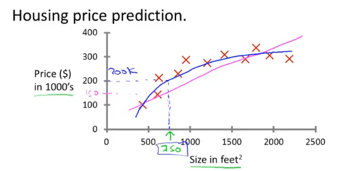
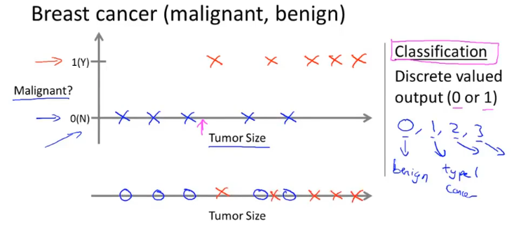
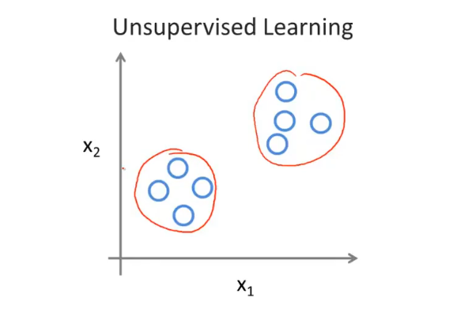
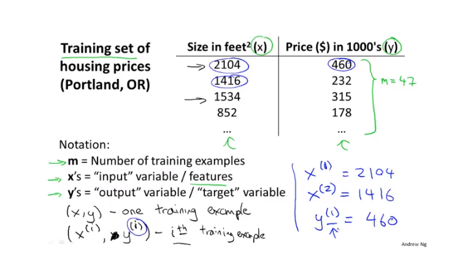
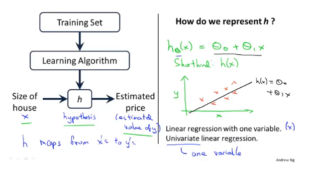

## 监督学习

监督学习是已经知道数据的label，例如预测房价问题，给出了房子的面积和价格。

- 回归问题是预测连续值的输出，例如预测房价。

  

- 分类问题是预测离散值输出，例如判断肿瘤是良性还是恶性。

  

## 无监督学习

无监督学习是不知道数据具体的含义，比如给定一些数据但不知道它们具体的信息，对于分类问题无监督学习可以得到多个不同的聚类，从而实现预测的功能。

## 线性回归

上标是指索引

线性回归是拟合一条线，将训练数据尽可能分布到线上。另外还有**多变量**的线性回归称为**多元线性回归**。

