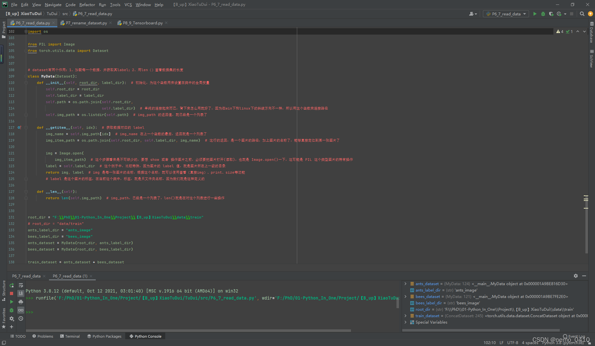

 

#### [PyTorch](https://so.csdn.net/so/search?q=PyTorch&spm=1001.2101.3001.7020)深度学习快速入门教程（绝对通俗易懂！）【小土堆】笔记

*   [教程与代码地址](#_1)
*   [P1 PyTorch环境的配置及安装（Configuration and Installation of PyTorch)【PyTorch教程】](#P1_PyTorchConfiguration_and_Installation_of_PyTorchPyTorch_7)
*   [P2 Python编辑器的选择、安装及配置（PyCharm、Jupyter安装）【PyTorch教程】](#P2_PythonPyCharmJupyterPyTorch_8)
*   [P3 【FAQ】为什么torch.cuda.is\_available返回False](#P3_FAQtorchcudais_availableFalse_9)
*   [P4 Python学习中的两大法宝函数（当然也可以用在PyTorch）](#P4_PythonPyTorch_10)
*   [P5 PyCharm及Jupyter使用及对比](#P5_PyCharmJupyter_17)
*   [P6 PyTorch加载数据初认识](#P6_PyTorch_20)
*   [P7 Dataset类代码实战](#P7_Dataset_35)
*   [P8 TensorBoard的使用（一）](#P8_TensorBoard_43)
*   [P9 TensorBoard的使用（二）](#P9_TensorBoard_56)
*   [P10 Transforms的使用（一）](#P10_Transforms_65)
*   [P11 Transforms的使用（二）](#P11_Transforms_85)
*   [P12 常见的Transforms（一）](#P12_Transforms_86)
*   [P13 常见的Transforms（二）](#P13_Transforms_91)
*   [P14 torchvision中的数据集使用](#P14_torchvision_93)
*   [P15 DataLoader的使用](#P15_DataLoader_102)
*   [P16 神经网络的基本骨架-nn.Module的使用](#P16_nnModule_120)
*   [P17 土堆说卷积操作（可选看）](#P17__125)
*   [P18 神经网络-卷积层](#P18__132)
*   [P19 神经网络-最大池化的使用](#P19__154)
*   [P20 神经网络-非线性激活](#P20__161)
*   [P21 神经网络-线性层及其他层介绍](#P21__164)
*   [P22 神经网络-搭建小实战和Sequential的使用](#P22_Sequential_168)
*   [P23 损失函数与反向传播](#P23__173)
*   [P24 优化器（一）](#P24__177)
*   [P25 现有网络模型的使用及修改](#P25__194)
*   [P26 网络模型的保存与读取](#P26__198)
*   [P27 完整的模型训练套路（一）](#P27__200)
*   [P28 完整的模型训练套路（二）](#P28__216)
*   [P29 完整的模型训练套路（三）](#P29__225)
*   *   [torch.nn.module.train()](#torchnnmoduletrain_227)
    *   [torch.nn.module.eval()](#torchnnmoduleeval_231)
*   [P30 利用GPU训练（一）](#P30_GPU_237)
*   [P31 利用GPU训练（二）](#P31_GPU_249)
*   [P32 完整的模型验证套路](#P32__260)
*   [P33 【完结】看看开源项目](#P33__264)

教程与代码地址
-------

笔记中，图片和代码基本源自up主的视频和代码

视频链接: [PyTorch深度学习快速入门教程（绝对通俗易懂！）【小土堆】](https://www.bilibili.com/video/BV1hE411t7RN?p=1)  
视频代码: [https://github.com/xiaotudui/PyTorch-Tutorial](https://github.com/xiaotudui/PyTorch-Tutorial)  
如果想要爬虫视频网站一样的csdn目录，可以去这里下载代码：[https://github.com/JeffreyLeal/MyUtils/tree/%E7%88%AC%E8%99%AB%E5%B7%A5%E5%85%B71](https://github.com/JeffreyLeal/MyUtils/tree/%E7%88%AC%E8%99%AB%E5%B7%A5%E5%85%B71)

P1 PyTorch环境的配置及安装（Configuration and Installation of PyTorch)【PyTorch教程】
------------------------------------------------------------------------

[安装PyTorch详细过程]: ./安装PyTorch详细过程.md


P2 Python编辑器的选择、安装及配置
---------------------------------------------------

（PyCharm、Jupyter安装）【PyTorch教程】
---------------------------------------------------

P3 【FAQ】为什么torch.cuda.is\_available返回False
------------------------------------------

# Python学习中的两大法宝函数

1.  dir()
2.  help()  
    

🐍

大家好，我们之前讲解了PyTorch的环境配置。这节课在正式进入PyTorch的语法学习之前，我们先来讲两个非常重要的函数。这两个函数可以说是你自学或者说是你学习过程中的两个大法宝。所以在正式讲解语法之前，我们先来学习这两个函数。

1. PyTorch工具箱的结构类似于一个分隔成多个区域的工具箱，每个区域包含不同的工具，有些区域甚至包含更小的工具箱。
2. 可以使用"There"道具获得打开操作，以查看工具箱内部的内容。
3. "Help"道具类似于一个说明书，可以用来了解如何使用特定工具。
4. 在实际操作中，可以通过打开PyCharm并打开Python控制台来进行Python代码的实践。
5. 使用"help"和"dell"函数来探索特定工具的结构和用法，"dell"函数能够显示所有可用的分隔区和工具，而"help"函数则提供了官方解释文档，帮助了解如何使用特定的函数或工具。
6. 下一步，将会介绍如何可视化数据，这对于理解基础语法之前的重要概念很关键。

当涉及具体代码演示时，我能够提供一些关于 `dir()` 和 `help()` 函数的示例，供您参考。

首先，`dir()` 函数用于列出指定模块、类、实例等的所有属性和方法。例如：

```python
import torch
# 列出torch模块的所有属性和方法
print(dir(torch))
```

接下来是 `help()` 函数，它用于获取有关指定对象的帮助信息。例如：

```python
# 获取torch.sum函数的帮助信息
help(torch.sum)
```

这些示例演示了如何使用 `dir()` 和 `help()` 函数来获取模块的属性和方法列表，以及获取特定函数的帮助信息。

P5 PyCharm及Jupyter使用及对比
-----------------------


## PyTorch加载数据初认识

在jupyter中：

```
from torch.utils.data import Dataset
# 查询Dataset的doc描述
# 方式一：
help(Dataset)
# 方式二：
Dataset??
```

三种数据集标签标注形式：  
第一种：文件夹名字就是标签名；  
第二钟：有另外一个文件记录下文件与标签的映射关系；  
第三种：文件本身带有标签名。

### Dataset类代码实战

详细代码看read\_data.py

from torch.utils.data import Dataset

os.path.join(self.root\_dir, self.label\_dir) 对地址字符串进行拼接，参数为可变形参

os.listdir(self.image\_path) 把路径下的文件装入到list容器中

### 关于 Dataset 数据加载

*   如何理解数据的加载呢？
*   就是说，要想获取自己电脑里的数据，读取它，那么就要遵守 pytorch 加载数据的规则。  
    他的规则就是 定义一个class类，继承 Dataset （from torch.utils.data import Dataset），并且，在类中，定义三个函数，分别是：初始化 init、获得每一个数据 getitem、数据长度 len。
*   这里面的过程，要很清楚：  
    1、路径、合并路径、把文件夹中的每一个文件名称，做成一个列表（这是init要做的事情）；  
    2、访问init中的列表，把列表的名称逐一传递给一个变量，命名为name，再次合并路径，并且把文件名连接在路径之后，接下来，用PIL中的Image.open函数，读取（加载）上述路径的文件（命名为img）（这里肯定是图像了），返回 图像img和标签 label（这是getitem的工作）；  
    3、最后用len（）返回列表的长度。
*   定义好 **类** 以后，后面就可以实例化这个类，定义参数（本例其实是一个路径，一个夹名称了），名称可以和定义类中的不一样，但是位置要对应（奥，这可能是Python课程里说的位置参数？）。
*   引用之前定义的类，把上述参数，传递进去。
*   最后打印自定义数据列表的长度。

### 可运行的代码

```python
import os

from PIL import Image
from torch.utils.data import Dataset


# dataset有两个作用：1、加载每一个数据，并获取其label；2、用len（）查看数据集的长度
class MyData(Dataset):
    def __init__(self, root_dir, label_dir):  # 初始化，为这个函数用来设置在类中的全局变量
        self.root_dir = root_dir
        self.label_dir = label_dir
        self.path = os.path.join(self.root_dir,self.label_dir)  # 单纯的连接起来而已，背下来怎么用就好了，因为在win下和linux下的斜线方向不一样，所以用这个函数来连接路径
        self.img_path = os.listdir(self.path)  # img_path 的返回值，就已经是一个列表了

    def __getitem__(self, idx):  # 获取数据对应的 label
        img_name = self.img_path[idx]  # img_name 在上一个函数的最后，返回就是一个列表了
        img_item_path = os.path.join(self.root_dir, self.label_dir, img_name)  # 这行的返回，是一个图片的路径，加上图片的名称了，能够直接定位到某一张图片了
        img = Image.open(img_item_path)  # 这个步骤看来是不可缺少的，要想 show 或者 操作图片之前，必须要把图片打开(读取)，也就是 Image.open()一下，这可能是 PIL 这个类型图片的特有操作
        label = self.label_dir  # 这个例子中，比较特殊，因为图片的 label 值，就是图片所在上一级的目录
        return img, label  # img 是每一张图片的名称，根据这个名称，就可以使用查看（直接img）、print、size等功能
        # label 是这个图片的标签，在当前这个类中，标签，就是只文件夹名称，因为我们就是这样定义的

    def __len__(self):
        return len(self.img_path)  # img_path，已经是一个列表了，len()就是在对这个列表进行一些操作


if __name__ == '__main__':
    root_dir = "F:\\PhD\\01-Python_In_One\\Project\\【B_up】XiaoTuDui\\data\\train"
    # root_dir = "data/train"
    ants_label_dir = "ants_image"
    bees_label_dir = "bees_image"
    ants_dataset = MyData(root_dir, ants_label_dir)
    bees_dataset = MyData(root_dir, bees_label_dir)
    train_dataset = ants_dataset + bees_dataset
```

### 完整代码 P6-7\_read\_data.py

```python
# from torch.utils.tensorboard import SummaryWriter

# ！usr/bin/env python3
# -*- coding:utf-8 -*-

"""
author :24nemo
 date  :2021年07月12日
"""

'''
Dataset：
能把数据进行编号
提供一种方式，获取数据，及其label，实现两个功能：
1、如何获取每一个数据，及其label
2、告诉我们总共有多少个数据

数据集的组织形式，有两种方式：
1、文件夹的名字，就是数据的label
2、文件名和label，分别处在两个文件夹中，label可以用txt的格式进行存储

在jupyter中，可以查看，help，两个方式：
1、help（Dataset）
2、Dataset？？

Dataloader：
为网络提供不同的数据形式，比如将0、1、2、3进行打包

这一节内容很重要
'''
'''
# writer = SummaryWriter("logs")

class MyData(Dataset):
    def __init__(self, root_dir, image_dir, label_dir, transform):
        #  初始化，为这个函数用来设置在类中的全局变量
        self.root_dir = root_dir
        self.image_dir = image_dir
        self.label_dir = label_dir
        self.label_path = os.path.join(self.root_dir, self.label_dir)
        self.image_path = os.path.join(self.root_dir, self.image_dir)
        self.image_list = os.listdir(self.image_path)
        self.label_list = os.listdir(self.label_path)
        self.transform = transform
        # 因为 label 和 Image文件名相同，进行一样的排序，可以保证取出的数据和label是一一对应的
        self.image_list.sort()
        self.label_list.sort()

    def __getitem__(self, idx):
        img_name = self.image_list[idx]
        label_name = self.label_list[idx]
        img_item_path = os.path.join(self.root_dir, self.image_dir, img_name)
        label_item_path = os.path.join(self.root_dir, self.label_dir, label_name)
        img = Image.open(img_item_path)

        with open(label_item_path, 'r') as f:
            label = f.readline()

        # img = np.array(img)
        img = self.transform(img)
        sample = {'img': img, 'label': label}
        return sample

    def __len__(self):
        # assert len(self.image_list) == len(self.label_list)
        return len(self.image_list)


if __name__ == '__main__':
    transform = transforms.Compose([transforms.Resize((256, 256)), transforms.ToTensor()])
    root_dir = "dataset/train"
    image_ants = "ants_image"
    label_ants = "ants_label"
    ants_dataset = MyData(root_dir, image_ants, label_ants, transform)
    image_bees = "bees_image"
    label_bees = "bees_label"
    bees_dataset = MyData(root_dir, image_bees, label_bees, transform)
    train_dataset = ants_dataset + bees_dataset

    # transforms = transforms.Compose([transforms.Resize(256, 256)])
    dataloader = DataLoader(train_dataset, batch_size=1, num_workers=2)

    # writer.add_image('error', train_dataset[119]['img'])
    # writer.close()
    # for i, j in enumerate(dataloader):
    #     # imgs, labels = j
    #     print(type(j))
    #     print(i, j['img'].shape)
    #     # writer.add_image("train_data_b2", make_grid(j['img']), i)
    
    # writer.close()

#  jupyter notebook 等方法，可以查看 help
'''

'''
以下内容是视频中完全一样的代码，截图，在 20210713 的笔记中，包括 python console 的代码也有保存
'''
```

### 运行结果



P8 TensorBoard的使用（一）
--------------------

TensorBoard是一个可视化工具，它可以用来展示网络图、张量的指标变化、张量的分布情况等。特别是在训练网络的时候，我们可以设置不同的参数（比如：权重W、偏置B、卷积层数、全连接层数等），使用TensorBoader可以很直观的帮我们进行参数的选择。

详细代码看P8\_Tensorboard.py

from torch.utils.tensorboard import SummaryWriter

容易遇到以下问题，以及tensorboard的安装问题  


[pytorch 1.6.0 出现ModuleNotFoundError: No module named ‘tensorboard‘错误](https://blog.csdn.net/weixin_42329982/article/details/108217630).

[urllib.error.URLError: urlopen error \[SSL: CERTIFICATE\_VERIFY\_FAILED\]](https://blog.csdn.net/weixin_42329982/article/details/108217630)

P9 TensorBoard的使用（二）
--------------------

详细代码看P8\_Tensorboard.py

1.  创建SummaryWriter类，传入logs文件输出地址
2.  图片文件地址
3.  Image类打开图片文件
4.  将Image类转换numpy格式
5.  SummaryWriter类加载numpy格式图片
6.  画图
7.  关闭SummaryWriter流

P10 Transforms的使用（一）
--------------------

详细代码看P9\_transforms.py

transforms一个torchvision下的一个工具箱，用于格式转化，视觉处理工具，不用于文本。  


按住ctrl，点击transforms  
  
再按住ctrl，点击transforms，就能看到transforms的源代码，左下角structure可以看到文件结构。  


它里面有多个工具类：  
Compose类：将几个变换组合在一起。  
CoTensor类：顾名思义，讲其他格式文件转换成tensor类的格式。  
ToPILImage类：转换成Image类。  
Nomalize类：用于正则化。  
Resize类：裁剪。  
RandomCrop：随机裁剪。

工具类都有\_\_call\_\_()方法，具体作用看[python中的 **call**()](https://blog.csdn.net/qq_35462323/article/details/89307534).

P11 Transforms的使用（二）
--------------------

P12 常见的Transforms（一）
--------------------

格式转换流程都大同小异，以Image转换成tensor为例：

1.  传入图片路径，创建Image类；
2.  创建ToTensor类；
3.  使用toTensor（image），传入Image类，调用ToTensor类的\_\_call\_\_()方法，返回Tensor类。

P13 常见的Transforms（二）
--------------------


P14 torchvision中的数据集使用
----------------------

进入[pytorch官网](https://pytorch.org/)  
  
讲述dataset和transform的联合使用。

代码见P10\_dataset\_transform.py。

路径中：’.‘表示当前目录，’ …'表示上层目录，Linux里的shell语法

P15 DataLoader的使用
-----------------

Dataset如果是一叠扑克牌的话，DataLoader就是一只手，参数就是告诉这只手怎么抓取扑克牌。

DataLoader常用参数：  
dataset (Dataset) – 使用哪个数据集

batch\_size (int, optional) – 一次抓取多少个数据，多少张牌

shuffle (bool, optional) – 是否重新洗牌

num\_workers (int, optional) – 多线程，windows下要设成0，不然会出错，出现

```
BrokenPipeError: [Errno 32] Broken pipe
```

drop\_last (bool, optional) – 当数据集大小不能被批大小整除时，设置为True则以删除最后一个不完整的批。False，则不删除，最后一批将变小。（默认值：False）

datasetloader加载批数据过程：  
代码见dataloader.py

P16 神经网络的基本骨架-nn.Module的使用
--------------------------

代码见nn\_module.py

input -> nn -> output，其中使用nn模型的时候，会自动调用\_\_call\_\_()方法，**call**()方法里面又调用了forword()方法，所以在继承一个nn模型的时候，要重写它的\_\_init\_\_()方法和\_\_forword()\_\_方法。

P17 土堆说卷积操作（可选看）
----------------

torch.nn模块会用就可以，相对于方向盘。  
torch.functional模块不需要掌握，相对于齿轮。

卷积原理的保姆级教程。  
代码见nn\_conv.py，使用torch.nn.functional模块。

P18 神经网络-卷积层
------------

  
conv2d常用参数：

in\_channels (int) – 输入通道数，RGB图像就是三通道。

out\_channels (int) – 输出通道数，也就是卷积核的个数，输入通道不为1的情况，

kernel\_size (int or tuple) – 卷积核大小，比如3就代表3×3的卷积核。

stride (int or tuple, optional) – 步长，卷积完成一次计算后，卷积核移动多少步。

padding (int, tuple or str, optional) – 填充，比如1就代表图像外围加一圈数据，默认都是0。

padding\_mode (string, optional) – 填充模式，“零”、“反射”、“复制”或“圆形”。 默认值：‘零’ 。

dilation (int or tuple, optional) – 内核元素之间的间距 . Default: 1，具体这里介绍[Dilated convolution animations](https://github.com/vdumoulin/conv_arithmetic/blob/master/README.md)

groups (int, optional) – 从输入通道到输出通道的阻塞连接数。 Default: 1

bias (bool, optional) –偏置，如果为 True，则向输出添加可学习的偏差。 默认值：真

P19 神经网络-最大池化的使用
----------------

class  
torch.nn.MaxPool2d(kernel\_size, stride=None, padding=0, dilation=1, return\_indices=False, ceil\_mode=False)

ceil\_mode – 对于float型，向上取整ceil还是向下取整floor。

代码见nn\_maxpool.py

P20 神经网络-非线性激活
--------------

关于RELU，原始数据是否原地操作：  


P21 神经网络-线性层及其他层介绍
------------------

代码见nn\_linear.py

视频18：58左右运动代码出错，是因为最后一个batch的大小<batch\_size的大小，应该要在datasetloader（）参数中设置drop\_last=True。

P22 神经网络-搭建小实战和Sequential的使用
----------------------------

以下是这个模型的代码，Sequential的作用就是简化代码块1，把代码块1装进去Sequential容器里，就是代码块2的代码了，然后代码块1就可以删除了。  
  
_**这里用tensorboard，可以得到非常牛逼的模型结构图**_

P23 损失函数与反向传播
-------------

代码见nn\_loss.py和nn\_loss\_network.py

由于loss()函数接收的数要是float类型，所以传入tensor数据的时候，要把tensor()参数中的dtype=torch.float32

P24 优化器（一）
----------

代码见nn\_optim.py

```python
# 优化器通常设置模型的参数，学习率等
optimizer = optim.SGD(model.parameters(), lr=0.01, momentum=0.9)
optimizer = optim.Adam([var1, var2], lr=0.0001)

for input, target in dataset:
	#把上一次计算的梯度清零
    optimizer.zero_grad()
    output = model(input)
    loss = loss_fn(output, target)
    # 损失反向传播，计算梯度
    loss.backward()
    # 使用梯度进行学习，即参数的优化
    optimizer.step()
```

P25 现有网络模型的使用及修改
----------------

出名的模型才会有现有的  
代码见model\_pretrained.py

P26 网络模型的保存与读取
--------------

代码见model\_save.py和model\_load.py

P27 完整的模型训练套路（一）
----------------

代码见model.py和train.py

format函数的用法：

```python
print("-------第 {} 轮训练开始-------".format(3))

输出：

-------第 3 轮训练开始-------

```

详细见：[Python format 格式化函数](https://www.runoob.com/python/att-string-format.html)

P28 完整的模型训练套路（二）
----------------

代码见train.py

查看验证集

torch.no\_grad函数：禁用梯度计算的上下文管理器。  
当您确定不会调用 Tensor.backward() 时，禁用梯度计算对于推理很有用。 它将减少原本需要 requires\_grad=True 的计算的内存消耗。

torch.no\_grad函数在用验证集的测试性能的时候使用，可以使得测试的过程中，不会计算用于反向传播的梯度，减小消耗。

P29 完整的模型训练套路（三）
----------------

在pytorch官网中ctrl+F搜索

### torch.nn.module.train()

将模块设置为训练模式。

这仅对某些模块有任何影响。 如果它们受到影响，请参阅特定模块的文档以了解其在培训/评估模式下的行为的详细信息，例如 Dropout、BatchNorm 等

### torch.nn.module.eval()

将模块设置为评估模式。

这仅对某些模块有任何影响。 如果它们受到影响，请参阅特定模块的文档以了解其在培训/评估模式下的行为的详细信息，例如 Dropout、BatchNorm 等

这相当于 self.train(False)。

P30 利用GPU训练（一）
--------------

代码见train\_gpu\_1.py

使用以下句式进行gpu加速：

```python
if torch.cuda.is_available():
    tudui = tudui.cuda()
```

使用time模块来计时

使用谷歌、天池的GPU加速

P31 利用GPU训练（二）
--------------

代码见train\_gpu\_2.py

使用以下句式进行gpu加速：

```python
device = torch.device("cuda")
# Tudui是一个神经网络模型
tudui = Tudui()
tudui = tudui.to(device)

```

P32 完整的模型验证套路
-------------

  
代码见test.py

P33 【完结】看看开源项目
--------------

06：00开始看，如何读懂github上面的代码

 

文章知识点与官方知识档案匹配，可进一步学习相关知识

[Python入门技能树](https://edu.csdn.net/skill/python/python-3-246?utm_source=csdn_ai_skill_tree_blog)[人工智能](https://edu.csdn.net/skill/python/python-3-246?utm_source=csdn_ai_skill_tree_blog)[深度学习](https://edu.csdn.net/skill/python/python-3-246?utm_source=csdn_ai_skill_tree_blog)390686 人正在系统学习中

本文转自 <https://blog.csdn.net/sinat_39448069/article/details/120866541>，如有侵权，请联系删除。