## 声卡设置

首先点击 Audio settings

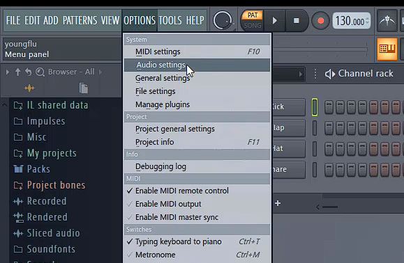

如果没有外接声卡，默认设置主驱动就行了

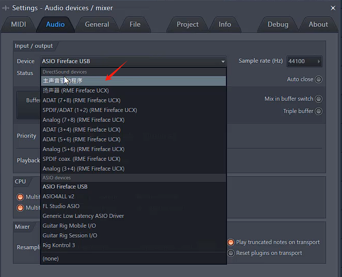

如果还安装了其他声卡驱动那么也可以选择其他声卡驱动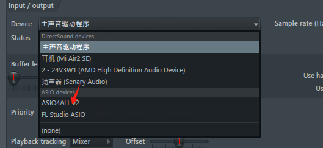

## 加载音源（音乐资源）

FL有自带的音源插件，第一个箭头要按鼠标右键（替换音源）

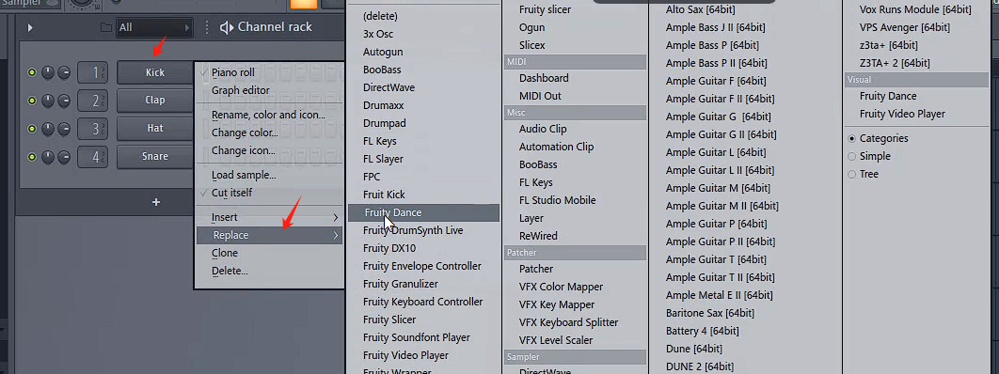

### 导入个人音源

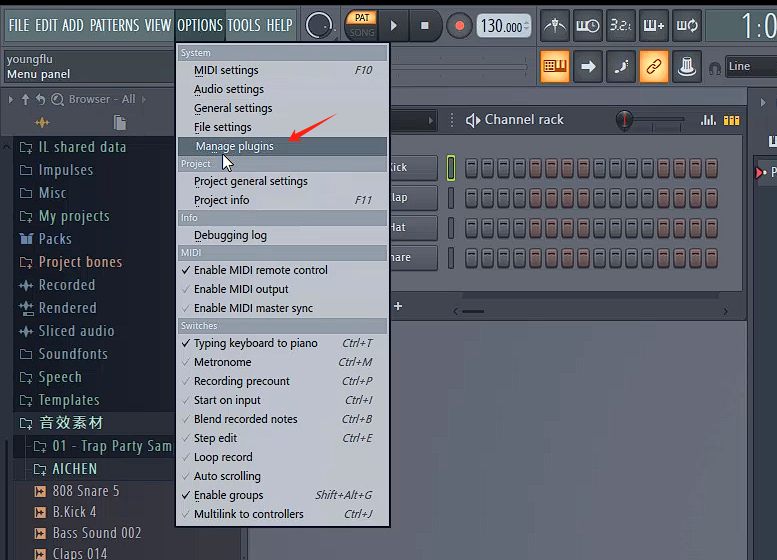

添加放有对应插件和软音源的文件夹，每一个软音源，在安装的时候，一定会提示你32bit，64bit的vst文件路径分别要放在什么地方。

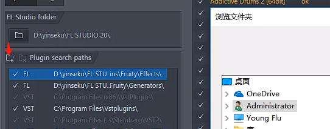

怎么去安装音乐，直接百度就行

然后点击扫描开始扫描，就会把插件都扫描出来

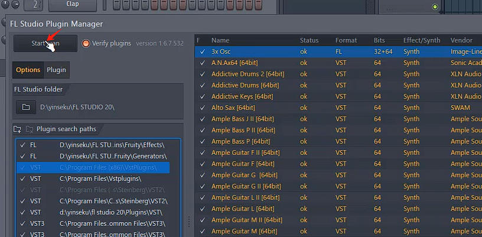

打勾来激活插件

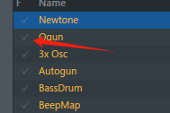

激活之后就可以在列表中替换成我们的激活的插件音频

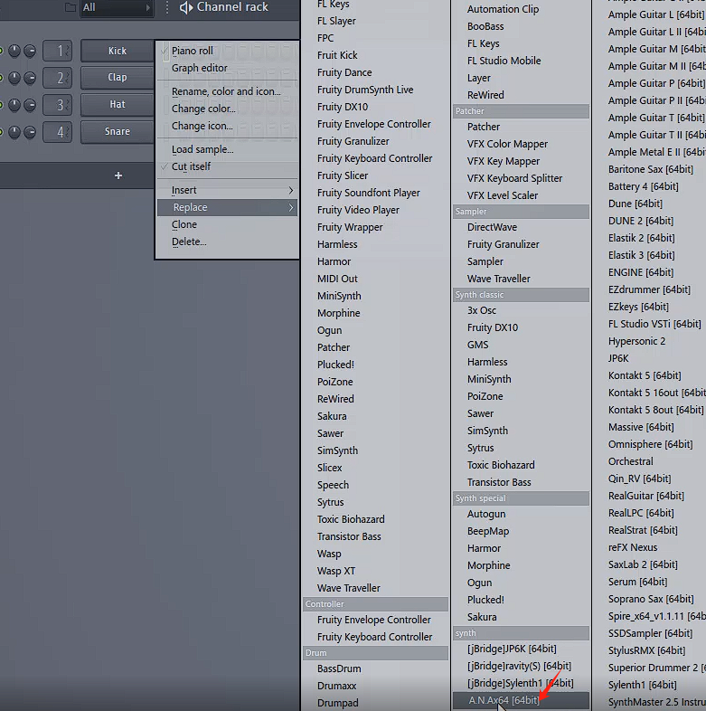

### 不替换插入新的音源

点击加号即可

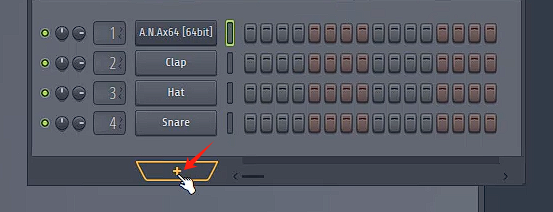

或者点击add也可以

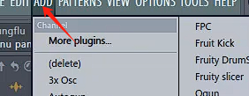

### 导入MP3，FLAC等音频文件

直接拖拽到相应想要放的位置即可

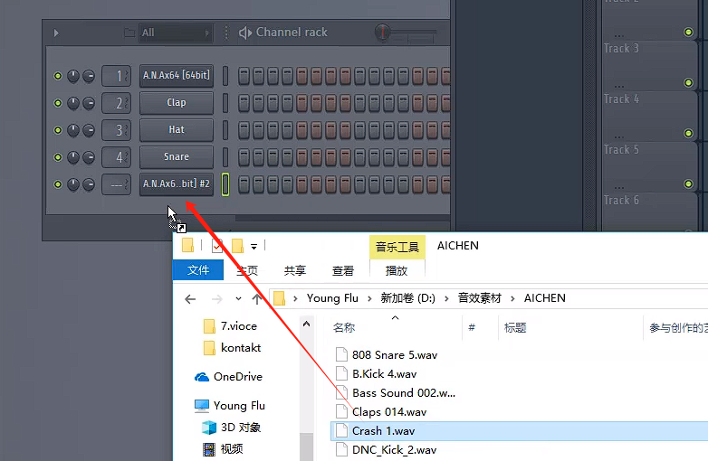

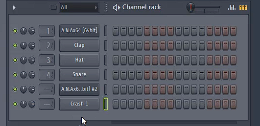

在此可以将音乐文件夹添加在左侧

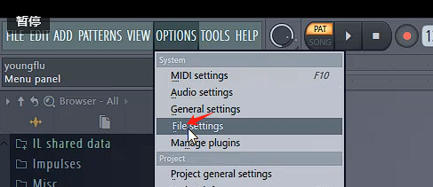

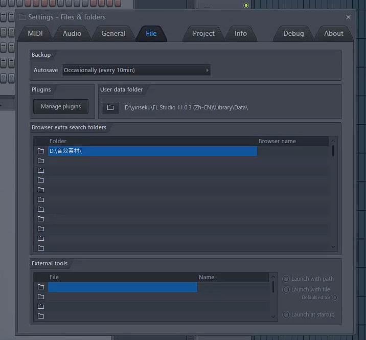

直接拖拽也行

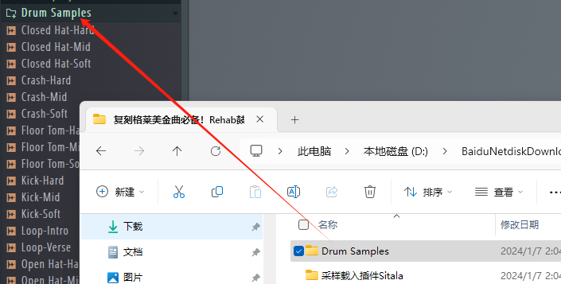

然后从左边拉出来的只能替换本来也是音源（音频文件）的东西

## 外设NIDI设置

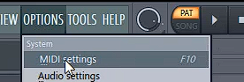

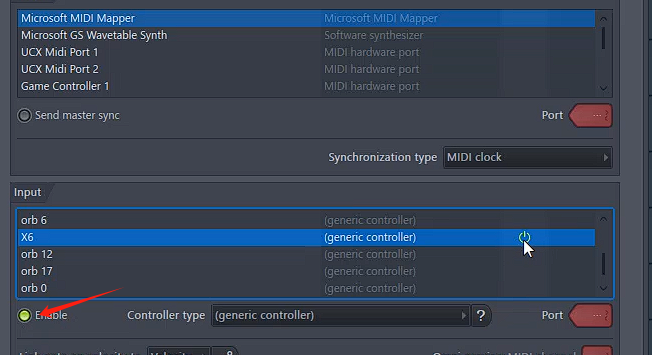

连接NIDI键盘

## 保存工程

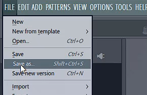

直接另存为

## 将歌曲工程导出为MP3等音频格式文件

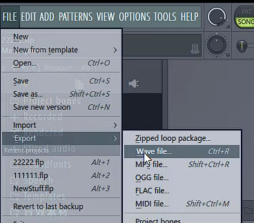

Full song导出所有，而pattern导出当前选择的pattern

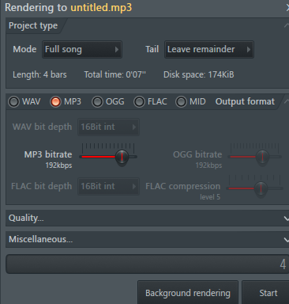

这个是导出分轨的意思，一般不需要打勾，除非后期混音需要之类的

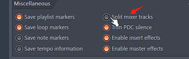