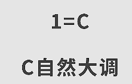
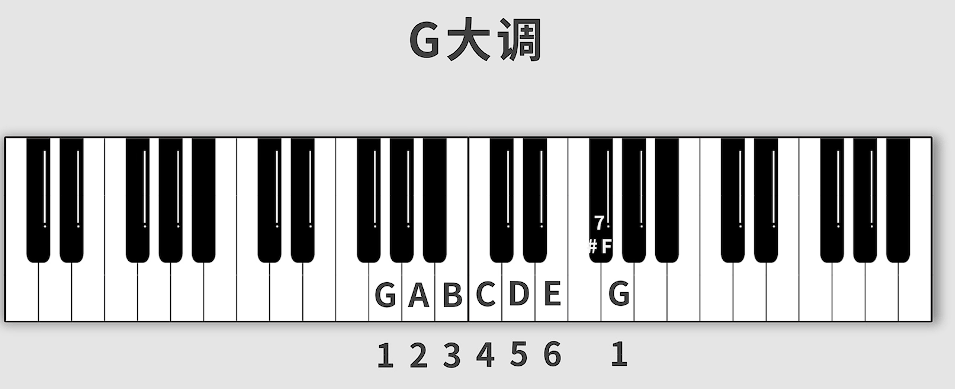

## 音名

尽量直接记CDEFGAB

## 升降号，还原号

### 升降号

两个相邻音之间叫做半音称之为半音关系

白键组中只有E和F，B和C是半音关系

白键和黑键相邻也是属于半音关系，黑键之间都至少隔着一个白键，所以黑键之间是全音关系

因为C和D中间隔了一个黑键所以是全音关系

黑键因为相对于白键是半音关系，所以是白键的升半调或者降半调

比如此处的黑键可以称之为升C键或者降D键，符号表示法在图中

### 还原号

加了还原号就会还原到原来的音

### EF和BC的升降调

F相当于升E，E相当于降F

这种称之为等音

升两次就是重升，降两次就是重降

也就是升或者降两次半音

这个一般用于包含了黑键式自然音的调式，然后需要对这个音进行升半音或者降半音

## 如何区分同一音名的不同键?

靠左侧是大字组，只有两组

从中间往右都是小字组一共五组，最后一组只有一个白键

## 音符时值及表示方法

音符的时值就是指音的长短

常见音符时值的表达方式，之后还有就都是短横线表示

## 歌曲拍号

### 拍号

拍号决定歌曲的节奏律动

一般以分数的形式表达

以4分音符为一拍，每小节有4拍。

左边的4为分子，右边的4为分母

### 小节

两条竖线之间就构成了小节

- 只要拍号不变，歌曲里面的每一个小节的长短都是一样的，不存在某个长某个短

四个四分音符是四拍，八个八分音符也是四拍

3/4 以4分音符为一拍，每小节有3拍

3/8 以8分音符为一拍，每小节有3拍

## 拍号的强弱规律

### 如何打拍子?

一拍的时值都是一样的

#### 强弱之分

只是概念，在实际音乐中并没有那么明显的区别度

## 歌曲速度(BPM)

仅通过音符时值及节拍，并不能得出具体的时间值,所以就有BPM

BPM:每分钟节拍数的单位

通过节拍及速度
即可计算出音符的时间。

## 附点音符

附点音符（dotted note）是音乐中的一个记号，它在音符的右侧加上一个点，表示该音符的持续时间增加一半。换句话说，附点音符的持续时间等于原始音符本身的持续时间加上其一半。

举个例子，假设有一个四分音符（quarter note）的持续时间为一个拍子，那么一个附点四分音符（dotted quarter note）的持续时间将为一个拍子加上半个拍子，即一个拍子半。

X指的是几分音符

写法是音符符号后面加一个点

## 三连音

**三连音**是指将三个相同时值的音符（如八分音符）按照特定的方式连续演奏或弹奏。在音乐符号上，三连音会在这三个音符上用一个弧线连接起来，表示它们需要被迅速演奏，并在同样的时间内完成。

三连音的意思是把一个整体切分成三等分

这里不是简单相加的关系，而是把二分音符分为三份，然后用比二分音符小一个单位的四分音符来表示

同理切分四分音符

**八分音符三连音，三个音长度加起来等于一个四分音符，时长等于，不是数学等于**

**就是说八分音符三连拍就是以四分音符为一拍，一拍里连弹三次等时的八分音符**

三个八分音符就是以四分音符为一拍，每个八分音符弹半拍

哒哒哒/哒 哒 哒

对于三个八分音符的三连音，可以用如下的方法演奏：

1. 将三个八分音符的时间均匀地分成三等分。

2. 先演奏第一个音符，持续时间占整个三连音的1/3。

3. 紧跟着演奏第二个音符，持续时间同样占整个三连音的1/3。

4. 最后演奏第三个音符，同样持续时间占整个三连音的1/3。

   

通过这种方式，你可以在相同的时间内演奏三个八分音符，形成一个快速连续的音符序列。记得在演奏过程中保持稳定和均匀的速度，使得三连音的节奏感更加明确和鲜明。

八分音符三连音的演奏方式可能听起来类似于“ti-ki-ta”或“tri-pl-et”：

ti-ki-ta ti-ki-ta ti-ki-ta ti-ki-ta ti-ki-ta ti-ki-ta ti-ki-ta ti-ki-ta
（8个八分音符三连音，共8拍）

而连续三个八分音符的演奏方式可能听起来类似于“ta-ta-ta”:

ta-ta-ta ta-ta-ta ta-ta-ta ta-ta-ta ta-ta-ta ta-ta-ta ta-ta-ta ta-ta-ta
（8个连续的八分音符，共8拍）

可以听出，八分音符三连音和连续三个八分音符的演奏方式是不同的，它们在节奏和音乐效果方面的呈现也不同。

> 尽管在同样的BPM下，八分音符三连音和连续三个八分音符可以在一拍内完成，但是演奏它们的方式确实不同，可能会产生不同的音乐效果。
>
> 对于八分音符三连音，在以同样的BPM演奏时，三个八分音符应该被均匀地分配在一个拍子的时间内。因此，一个八分音符三连音会被演奏为三个音符，每个音符都有相同的持续时间，强调第一个音符，而不是第三个。这种演奏方式可以创造出独特的节奏效果，使音乐更加有趣。
>
> 对于连续的三个八分音符，同样在以同样的BPM演奏时，每个八分音符将被等分为一个拍子内的三个相等部分。每个音符的持续时间相等，没有强调任何一个音符。这样的演奏方式通常会呈现出更加连续的节奏感，而不像八分音符三连音那样突出强调特定的音符。
>
> 因此，在实际演奏中，八分音符三连音和连续三个八分音符虽然可以在同样的BPM下演奏完毕，但是它们的演奏方式和音乐效果确实不同。

## 音与节奏的应用

[11 音与节奏的应用_哔哩哔哩_bilibili](https://www.bilibili.com/video/BV1Hg411w7n2?p=11&spm_id_from=pageDriver&vd_source=a0e678f0a699f40cb533e1a6673f35fa)

## 唱名与简谱数字

但唱名和简谱名对等

## 自然大调 

常见的简谱表示形式

### 调式

在流行音乐中，最常见的调式是大调和小调(是自然大调或小调的简称)。大调音乐常常给人一种明亮、欢快、乐观的感觉，适合表达愉快、快乐的主题。许多流行歌曲的副歌部分通常会采用大调，以增强歌曲的放松、欢快的氛围。

小调音乐在流行音乐中也很常见，它通常给人一种深情、哀伤、忧郁的感觉，适合表达悲伤、思念、痛苦等情感。许多流行歌曲的抒情部分或慢歌通常采用小调，以增强情感的表达和共鸣。

此外，流行音乐中也会使用其他调式和模式，以增加音乐的变化和个性。例如，在流行乐队的编曲中，可以加入爵士调式、福音小调等，以赋予音乐更加复杂的和声和色彩。

#### 自然调式

自然调式分为大调和小调(是自然大调或小调的简称)。

##### 自然大调(白键)

下图只在1=C的情况下成立

 

记住 全全半全全全半 这个规律，其他的大调弹奏方法也是这样来的

##### 自然大调(黑键)

## 自然小调

落在白键上面

记住 全半全全半全全 这个规律，其他的大调弹奏方法也是这样来的

小调往前走一个全音和半音就得到了它的关系大调

## 大小调的区别

都可以的，不一定小调就伤感，大调就欢快

## 音乐风格

### 布鲁斯

布鲁斯（Blues）是一种音乐风格，起源于美国的非洲裔美国人社区，特别是在20世纪初的农村地区。它是一种深情的音乐形式，通常以悲伤、忧郁、苦难和渴望为主题。

布鲁斯音乐通常以简单的和弦进程为基础，使用吉他、口琴、钢琴和其他乐器来演奏。它的节奏感较慢，旋律上常常使用蓝调音阶和蓝调音程，这些特点为布鲁斯音乐赋予了独特的和声和情感特性。

布鲁斯的歌词通常表达个人经历、人生困境和情感冲突。这种音乐形式在20世纪初的非洲裔美国人社区中迅速传播，并成为其他音乐风格（如摇滚乐和爵士乐）的重要影响力之一。

布鲁斯音乐可以被视为美国大众音乐的重要组成部分，并对整个音乐界产生了广泛的影响。它不仅在音乐上具有独立的地位，还成为了文化、社会和历史的重要象征，代表了非洲裔美国人的艺术和文化传统。

