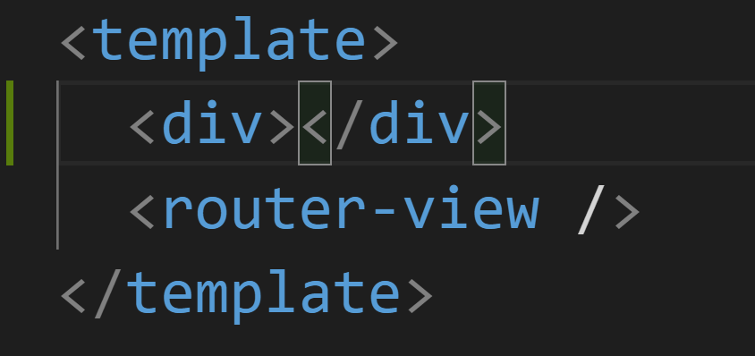

# 关于 `vetur` 检测 `template` 的单一根元素的问题

在 `vue2` 中，`template` 只允许存在一个根元素，但是这种情况在 `vue3` 里发生了一些变化。

在 `Vue3` 中开始支持 `template` 存在多个根元素了。但是因为 `VSCode` 中的一些插件没有及时更新，所以当你在 `template` 中写入多个根元素时，有可能会出现以下的错误：

出现这个问题的原因主要是： `vetur` 这个 `vsCode` 插件依然按照 `vue2` 的单一根元素逻辑进行检测，所以会出现提示错误的问题。

但是大家要注意，虽然这样不太好看，但是 **该问题并不影响代码运行！**

如果你实在觉得这样太丑的话，那么可以通过以下方案来 **取消 `vetur` 对 `template` 的检测：** 

1. 在 `VSCode`  的设置中，搜索 `vetur`，找到如下设置，取消勾选

2. 重启 `VSCode`

按以上两种方式执行之后，你的多根元素就不会出现不好看的错误了
