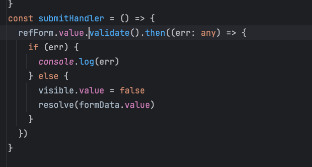

## promise


## 表单验证



## v-model.number

将v-model的数字字符串转成number类型

使用场景：表单校验

例子：

```vue
      <a-input  v-model.number="formState.blockTokenNumber" style="width: 40px;padding: 0;"></a-input>
```

验证规则改成数字,指定type:"number"，数字大小判断为min,max。字符串长度判断为minLength,maxLength

```js
export const blockTokenNumber = [{
  required: true,
  message: '请输入块Token数'
}, {
  type:"number",
  max: 256,
  message: '块Token数不能大于256'
},
   {
     type:"number",
    min: 1,
    message: '块Token数不能小于1'
  }
] as FieldRule[];
```

v-model.lazy

v-model.trim

## endsWith

`endsWith` 方法是 JavaScript（和TypeScript）中的一个字符串方法，用于检查一个字符串是否以指定字符串结尾，根据情况返回 `true` 或 `false`。以下是它的工作原理及如何在你的例子中使用它：

```typescript
let filename = 'example-file.jpg';
let ext = '.jpg';

console.log(filename.endsWith(ext)); // 输出 true
```

在这个例子中：
- `filename.endsWith(ext)` 检查字符串 `filename` 是否以字符串 `.jpg` 结尾。
- 因为 `'example-file.jpg'` 以 `'.jpg'` 结尾，所以该方法返回 `true`。

如果你想要进行大小写不敏感的检查（以考虑后缀名的大小写变化），可以在使用 `endsWith` 前将 `filename` 和 `ext` 转换为小写：

```typescript
let filename = 'example-file.JPG'; // 大写后缀名
let ext = '.jpg';

console.log(filename.toLowerCase().endsWith(ext.toLowerCase())); // 输出 true
```

在这个例子中，`.toLowerCase()` 被用于 `filename` 和 `ext`，以确保比较时不考虑大小写。这种方法在希望忽略文件名和后缀名大小写差异时非常有用（比如 `'.jpg'` 和 `'.JPG'` 视为相同）。

当结合迭代后缀名数组来检查文件名是否以指定后缀名结尾时，这种方法尤为有效，如前面的示例所示。

## textareaRef.value[index].focus()

## defineExpose({open})

## watch

```js
watch(
    () => props.data,
    () => {
      //如果新建的会话收到回复的时候就自动新建历史会话,并且选择
      if(newOrOld.value){
        //自动创建会话信息并进入
        emit('autoCreateHistoryFun');
      }else{
        // 当监听到有消息传入的时候调用回复方法产生回复
        readChatbotReply();
      }
    }
);
```

## 设置滚动条颜色透明

要将 `<a-textarea>` 的垂直滚动条设置为透明，您可以通过以下 CSS 样式来实现：

```css
.a-textarea::-webkit-scrollbar {
  width: 10px; /* 设置滚动条宽度 */
}

.a-textarea::-webkit-scrollbar-thumb {
  background-color: transparent; /* 将滚动条滑块背景色设为透明 */
}

.a-textarea::-webkit-scrollbar-track {
  background-color: #f1f1f1; /* 滚动条轨道颜色 */
}
```

通过将 `.a-textarea::-webkit-scrollbar-thumb` 的 `background-color` 属性设置为 `transparent`，可以使垂直滚动条滑块变为透明。同时，您可以继续调整其他滚动条样式属性以满足您的需求。这样，您就可以让 `<a-textarea>` 的垂直滚动条变为透明。

## 阻止默认换行操作

```
  if (e.key === 'Enter') {
    e.preventDefault(); // 阻止默认的换行行为
    // 在这里可以执行您想要的操作，比如向文本框插入特定内容或触发其他事件
  }
```

## img https ssl错误

当浏览器发出 "net::ERR_CERT_COMMON_NAME_INVALID" 错误时，这通常表示 SSL 证书中的通用名称与浏览器请求的域名不匹配。这是因为网站使用了一个无效的 SSL 证书导致的安全性问题。

如果你想要在遇到这个问题时仍然加载图片，你可以考虑使用 `crossorigin` 属性来设置图片的跨域属性。这样可以绕过某些安全限制，但也可能会带来潜在的安全风险，请谨慎使用。

在 `img` 标签中添加 `crossorigin` 属性可以尝试解决这个问题，示例代码如下：

```html

```

在上面的示例中，将 `crossorigin="anonymous"` 添加到 `img` 标签中，这将请求带有 "Origin" 头部的图片，并防止该图片将用户的凭据发送到服务器。

请注意，使用该方法是为了绕过浏览器的安全阻止，可能会带来一定的风险。最佳的做法是为你的网站配置有效的 SSL 证书，以确保安全性和隐私保护。