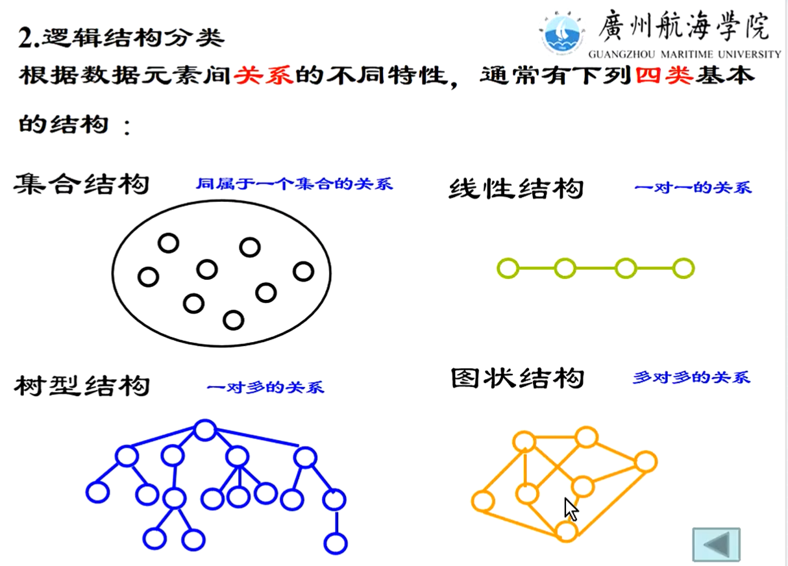

## 数据结构的基础知识讲解

主要讲解了一些基础的知识，包括数据结构的定义、概念、物理结构、逻辑结构和运算。数据结构是指相互之间存在特定关系的数据元素的集合，包括逻辑结构、物理结构和运算。逻辑结构有集合结构、线性关系、树形结构和图状结构等。线性结构是一对一的关系，非线性结构是一对多的关系。讲解过程中还提到了一些具体的例子，如集合、树形、树形和图状结构的实际应用。

#### 线性结构与非线性结构的存储与应用

主要讨论了线性结构、非线性结构、物理结构和存储方法。线性结构包括线性表、队列、串数组等，它们都符合一对一的关系。非线性结构包括竖图、数图等，它们不符合一对一的关系。物理结构最常用的两种方法是顺序结构和链式结构，如线性表、队列、串数组、树等。此外，还讨论了数据存储方式、数据的运算和线性表的优缺点。

****

#### 单链表的实现与特点

主要讲述了单链表的实现和特点。单链表的节点构成包括数据域和指针域，数据存储为有用的数据，如序列。在单链表中，有一个头节点，头节点的指针指向第一个元素，即元首节点。链表可以为空，没有数据域和指针域，但有一个头来标识。链表使用顺序存储，不是随机的，可以通过一些基本运算建立单列表。

#### 单链表的创建与插入操作

主要介绍了单链表的创建、头插法和尾插法以及求表长的方法。首先，通过头插法初始化一个空的单链表，然后在空链表的基础上插入新节点。接着，通过尾插法在链表的末尾插入新节点。最后，通过求表长的方法，计算出数据节点的数量。在代码实现过程中，需要注意一些关键点，如判断代码是否超出范围、计数器的初始值等。

#### 链表操作与数据查找的实现过程

主要讲述了链表的插入、删除和查找操作。首先，通过P指针找到数据所在的位置，然后判断是否超出表，若超出则死循环。接着，插入操作时，需要先找到数据，然后将数据复制给Q指针，最后将Q指针指向P指针的前驱节点。删除操作时，同样需要找到前驱节点，将有用信息榨干后释放。最后，通过循环输出链表中的所有元素。

#### 线性表存储与递归算法应用

主要讲述了线性表的顺序存储和堆存储。顺序表的列式存储在函数中应用广泛，但要注意递归条件的设置，以避免无限循环和内存占用。线性表包括栈、队列等特殊类型，它们在内存中的数据都是按线性排列的。顺序存储和堆存储是两种不同的物理存储方式，顺序存储是一维数组，而堆存储则是连续的地址空间。

#### 数据存储与出站操作的实现原理

主要讲述了站和堆空间的概念、特点以及如何使用。首先，站是一个可以存储六个元素和六个数据的空间，同一种类型的数据。当top top的值为零时，就指向了数组里的下标。在内存中，top始终指向一个空的空空间，等待数据的入站。当站满时，如果再入站，就会导致上溢，因此要避免这种情况。其次，堆空间是一个动态分配的内存空间，可以用来存储数据。在堆中，可以使用头插法创建链表，遵循站的规律。最后，操作系统在后台为程序自动分配了空间，程序调用完毕后，系统会自动释放。

#### 队列操作与线性表实现

主要讲述了队列的概念、特点以及操作。队列类似于挂号系统，具有先进先出（FIFO）的原则。在插入和删除数据时，使用rear指针和front指针进行操作。在顺序存储中，队列也是线性表，用一维数组实现。在判断队列是否满时，不能仅凭指针，需要使用循环来判断。

#### 循环队列问题的解决方案

主要讨论了循环队列的实现方式。首先，循环队列的初始化时，头节点和尾节点指向同一个节点，当队列为空时，头节点指向尾节点的后面。在入队和出队过程中，通过尾指针进行操作，当尾指针到达指定位置时，立即加一。循环队列的定义中，有一个一维数组和一个头指针和一个尾指针。当队列满时，插入操作失败。此外，还讨论了循环队列的进出队方式，以及如何处理空队列。

#### 数组的顺序存储与降维

主要讲述了数组的顺序存储、特殊矩阵、降维、一维数组和二维数组的定义及其基本操作。首先，讲者介绍了数组的顺序存储，包括行和列的存储方式。然后，讲解了特殊矩阵，如对称矩阵、三角矩阵和带状区域的矩阵，它们在存储数据时可以节省空间。接着，讲者详细解析了一维数组和二维数组的定义及其特点，以及如何使用一维数组和二维数组进行操作。最后，讲者介绍了C语言中给不同类型起别名的方法，以便在后续使用时能够更方便地引用。

#### 数组存储与地址计算原理解析

主要讲述了数组的存储方式以及如何通过偏移量计算出数组的地址。首先，一维数组以行为主进行存储，而二维和三维数组则以列为主。接着，通过基址基本地址（AI）和偏移量（G）来计算出数组的地址。例如，在一维数组中，要计算出某个元素的地址，需要知道该元素前面有多少个元素，以及每个元素占用的空间大小。通过这个机制，可以轻松地找到数组的地址。

#### 数据存储与偏移量的计算方法

主要讲述了如何计算一个二维数组中某个位置的字数。首先，需要知道每一页有多少个字，然后将这些字加起来。接着，在第三页上找到第二行第二个字的位置，然后计算前面有多少个字。最后，将偏移量、每个字占用的空间大小和偏移量相乘，就可以得到这个位置的字数。这个过程涉及到数组的存储、数据压缩等方面，旨在提高数据处理效率。

#### 矩阵存储与数据压缩的原理与应用

主要讨论了特殊矩阵的存储方式以及如何通过一维数组来存储和查找。首先，对称矩阵的存储方式是压缩一半空间，然后将数据放在一维数组中。接下来，通过等差数列求和公式计算出每一行的数据，并将它们存储在一维数组中。最后，通过公式计算出K的值，并将其存储在对应的位置。这样的存储方式可以提高查找速度，同时减少空间占用。

#### 矩阵存储与元素索引的计算方法

主要讲述了如何确定K下标值，以及如何存储三角矩阵。首先，通过数AIG前面有多少个元素，可以确定K下标值。然后，将三角矩阵存储到一维数组中，通过上三角压缩前，N阶的压缩后，将常量、商存储到整个数组的最后。最后，通过对应关系找到相应的位置，填补其他位置。这样，就可以得到AIG前面有多少个元素，从而确定下标值。

#### 三阶对角矩阵的存储与压缩

主要讲述了如何压缩N阶对角矩阵，以及稀疏矩阵的存储方式。对于N阶对角矩阵，可以通过压缩来存储非零元素，将有效的数据存储在一维数组中。对于稀疏矩阵，由于其零元素较多，非零元素较少，因此只需存储非零元素的行坐标、列坐标和自身值。通过三元组表来表示这些非零元素的值，并将三元组表放入一维数组中。

#### 数组与二叉树的讲解

主要讲述了数组、二叉树等计算机科学中的基本概念。首先，数组是结构体数组，由行坐标、列坐标和自身值组成，用于存储一系列元素。其次，二叉树是一种非线性的数据结构，以分支关系定义层次结构，每个集合本身符合本定义，又有根节点。二叉树的性质包括：a层上最多有2^(i-1)个节点；左子树和右子树分别称为左孩子和右孩子，满足互不相交的有限集合。最后，二进制是计算机中存储数据的基本单位，数据在光盘、硬盘等存储介质中都是以二进制形式存储。

#### 二进制与二叉树的转换理解

主要讲述了二进制和二叉树的相关知识。首先，通过数学逻辑，将二进制转换为十进制。然后，通过二叉树的层次结构，介绍了第一层、第二层、第三层和第四层的节点数。接着，讲述了叶子节点数的计算方法，即度为二的节点数加上一个一，再加上叶子数。最后，通过实例解析，说明了叶子节点数多于度为二的节点数的二叉树。

#### 深度学习中的完全二叉树与马尔查数

本段内容主要讲述了完全二叉树与马二叉树的性质和区别。完全二叉树与马二叉树都是满二叉树的子集，但完全二叉树的定义不同于马二叉树。以以2为底，log N加一为例，当节点数为N时，深度为log N+1，符合以2为底的完全二叉树的性质。此外，还介绍了完全二叉树的节点编码方式，每个节点的编号与其双亲、左孩子、右孩子等编号有关，与节点值无关。

#### 完全二叉树的性质与存储方式

主要讲述了完全二叉树的性质、存储方式、存储结构以及二叉树层次遍历算法。完全二叉树是一种特殊的二叉树，当节点个数为偶数时，不是满二叉，有且仅有一个度为一的节点。在完全二叉树中，编号大于N的节点均为叶子节点。存储方式分为列式和顺序两种，顺序存储遵循由上到下、由左向右的方式。二叉树层次遍历算法需要掌握规律，如马二叉的编号与节点数的关系等。

#### 二叉树遍历与层次建立算法

主要讲述了二叉树的遍历和叶子节点数统计。首先，通过双循环遍历二叉树，将每一层首节点的编号存储在一维数组中。然后，通过交换指针，实现左右子树节点的交换。最后，通过计数器统计叶子节点数，因为叶子节点本身是有值存在的，没有左孩子和右孩子。在遍历过程中，要保证计数器的范围不超出整个二叉树的范围。

#### 二叉树链式存储结构及其遍历方法

主要介绍了二叉树的链式存储结构，包括节点、左孩子指针、右孩子指针等。同时，讲者提到了二叉树的基本操作，如查找、插入、删除等。接着，讲者详细讲解了二叉树的遍历策略，包括顺序存储、先左子树后右子树、先右子树后左子树等三种方法。最后，讲者对二叉树的链式存储结构进行了总结，并介绍了二叉树的遍历过程。

#### 二叉树遍历与唯一性确定

主要讲述了二叉树的递归遍历算法。首先，先访问根节点，然后递归地访问左子树和右子树。通过左右子树的高度，判断整个二叉树的深度。递归遍历的代码非常简单，可以用来统计二叉树中节点、叶子节点的个数。在递归过程中，如果左子树或右子树为空，则返回零。通过左右子树高度和递归遍历，可以计算出整个二叉树的高度。

#### 图的基本概念与应用

主要介绍了图的基本概念和术语，包括顶点、边、子图、无向图、有向图等。同时，讲者还提到了一些应用场景，如邻接点与度邻接点的定义，以及邻接点和逆临界点的概念。最后，讲者提到了赋权图的概念，并对其进行了简单的解释。

#### 图论基础概念与算法解析

主要讨论了图的基本概念和性质。首先，顶点的度是指射出多少条边，有向图的度包括入度和出度。其次，简单路径是不重复的，如从A到B再到C再走F再回到C，这样的路径被称为简单图。再次，联通是指相通的，如从V零去到V三，或者从V三去到V零。单向连通是指从一个顶点可以走向另一个顶点，但不能回得来。最后，部分单向连通是指一个或几个点可以走到其他所有点的顶点，但其他顶点不一定能走回。此外，图的存储方式分为列式存储和顺序存储，连接矩阵用于表示无向图。

#### 图形的对称矩阵与有向图存储

主要讨论了矩阵在图论中的应用。首先，通过矩阵，我们可以很容易地计算顶点的度、入度和边数。然后，通过观察矩阵，我们可以发现有向图和无向图在连接方式上有所不同。有向图中，顶点之间的连接是有箭头的，而无向图中，顶点之间的连接是无箭头的。最后，会议还讨论了矩阵的存储空间问题，虽然矩阵可以存储二维数组，但需要较大的空间。

#### 图结构存储方式及其优缺点分析

主要讨论了图的存储方式，包括无向图、有向图和邻接表。无向图中，空间有效利用率为公方，适用于存储稠密图，对稀疏图而言浪费。有向图中，连接表是一种劣势存储，但可以减少占用存储单元。邻接表中，节点数除以二即为边数，占用的存储单元较少。此外，还讨论了有向图中的度、入度和出度计算方法。

#### 二叉排序数与二分查找的讲解

主要讲述了二叉排序数、二分查找和二叉链表的相关知识。首先，介绍了二叉排序数的定义和结构，以及如何通过二分查找找到关键字。接着，讲解了二叉链表作为存储结构，如何在插入元素时进行查找，以避免插入失败。最后，通过一个具体的例子，演示了二叉链表在查找过程中的应用。

#### 二叉排序树的创建与删除过程

这段内容主要讲述了如何创建一棵二叉排序树。首先，根据二叉排序树的原则，将给定的序列按照大小排列。然后，通过中序遍历和正序遍历得到有序的序列。接着，删除节点时，要考虑其孩子的问题，即它的孩子由谁接管。删除分为三种情况：叶子节点、非叶子节点和被删除的节点。对于非叶子节点，只需将其子树移至其父树即可。最后，通过遍历得到有序的序列。

#### 二叉排序树的删除操作

这段内容主要讲述了在二叉排序树中删除节点的问题。当待删除的节点只有左孩子或右孩子时，可以通过找到双亲来处理；当待删除的节点既有左子树又有右子树时，需要先找到最靠右的子树，然后用其孩子来接替位置。在处理复杂情况时，可以采用交换的方式进行操作。总之，通过以上方法，可以有效地处理二叉排序树中的删除问题。

#### 二叉排序算法的优化与平衡二叉树的构建

主要讲述了如何删除节点、查找分析以及平衡二叉树的相关知识。首先，通过删除节点和替换节点的值，可以实现对整个树结构的调整。其次，通过二叉排序算法，可以计算出查找某个节点的平均查找长度。最后，介绍了平衡二叉树的定义和特点，以及如何根据序列构造平衡二叉树，以提高查找速度。

#### 二叉树平衡调整与哈希表构建

主要讲述了二叉树平衡调整的方法和散列表的哈希表。首先，通过左右子数之差或平衡因子控制在绝对值小于一的范围内，对二叉树进行平衡。其次，介绍了哈希表的构造方法，包括三列函数、开放地址链地址和建立公共地址等。最后，针对冲突处理方法，介绍了开放地执法和线性探测两种解决冲突的方法。

#### 线性探测与平方探测在数据冲突解决中的应用

主要介绍了线性探测法、平方探测法以及平均查找长度的计算方法。线性探测法是一种解决冲突的方法，通过不断尝试不同的地址值，直到找到一个空闲的地址。平方探测法则是通过在表中取增量值，然后进行平方探测，找到第一个未被占用的位置。平均查找长度则是将所有元素的探测次数加起来，再除以元素个数。这些方法在实际应用中可以有效解决数据冲突问题。

