# 第五章   波动光学

## 1.光的干涉

### 一、光源 光的相干性 

#### 光是一种电磁波

- **可见光**：波长范围在400～760 nm之间
- **红外线**：波长在760 nm以上到600 μm左右
- **紫外线**：波长在400 nm以下到5 nm左右

##### 单色光

具有单一频率或波长的光称为**单色光**.

> 实际上频率范围较窄的光，就可以近似地认为是单色光，光的频率范围越窄，其单色性越好。

##### 复色光

具有各种频率的光称为**复色光**.

#### 普通光源的发光特点

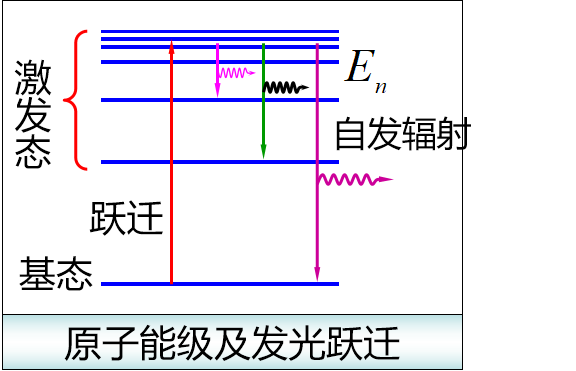

这一跃迁过程所经历的时间很短，约为$10^{-8}s$

#### 相干光的获得

**相干光**：频率相同、振动方向相同、相位差恒定

> 从同一光源上同一点发出的光，通过某种装置分成两束或多束光，使它们沿不同路径传播，然后再让它们相遇，则在相遇区域中就能产生干涉现象. 

##### 波面分割法

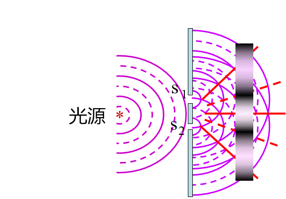

> 这种将一个点光源的波面分割为两束光，以获得相干光的方法称为**波面分割法**。

##### 振幅分割法

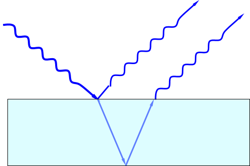

   这种利用界面的反射和折射，将光矢量的振幅分为两部分，以获得相干光的方法称为**振幅分割法**。

### 二.双缝干涉

1802年，英国科学家托马斯·杨(Thomas Young)

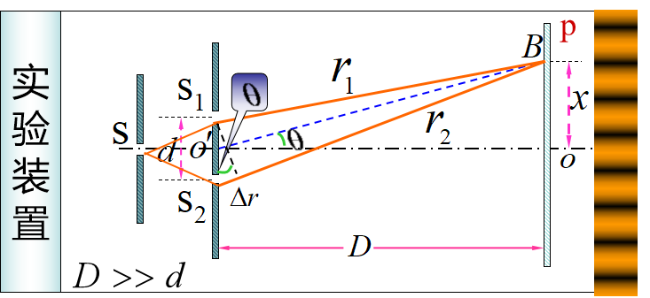

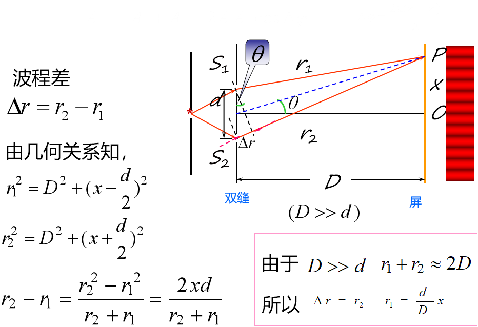
$$
A = \sqrt{A_1^{2}+A_2^2+A_1\cdot A_2\cos\Delta\varphi} \space\space\space\space \Delta\varphi = \frac{2\pi(r_2-r_1)}{\lambda}
$$

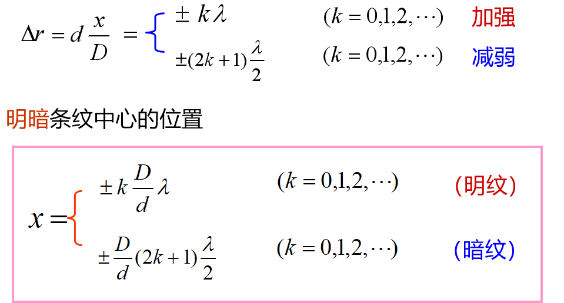

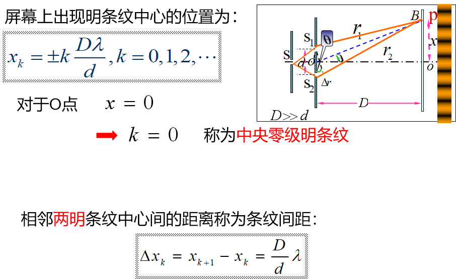

#### 结论

- 干涉明暗条纹是等距离分布的，要使$\Delta x$能够用人眼分辨，必须使D足够大，d足够小，否则干涉条纹密集，以致无法分辨. 

$$
\Delta x_\lambda-x_\lambda = \frac{D}{d} \cdot \lambda
$$

- 当单色光入射时，若已知d和D值，可通过实验测出条纹间距$\Delta x$，再根据                        $\Delta x = D\lambda/d$可计算出单色光的波长。
- 当采用白光照射时，只有中央明纹是白色的**(当x = 0，对任一波长的光均是明条纹中心)**，其余各级明条纹   呈现由紫到红的彩色条纹。

 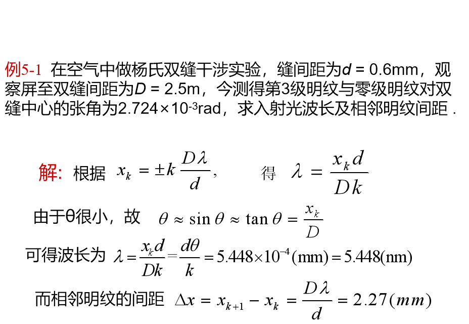
$$
x_k = \pm k \frac{D\lambda}{d},k=0,1,2,\cdots
$$

### 三、光程和光程差

由于波传播一个波长的距离，相变化2π，若光在介质中传播的几何路程为r,则相应的相变化为：

#### 光程

 当光在介质中传播时，把折射率n 和几何路程r 的乘积称为光程。

**物理意义**：

把单色光在介质传播的路程，折合成该单色光在真空中传播的路程。

#### 光程差 

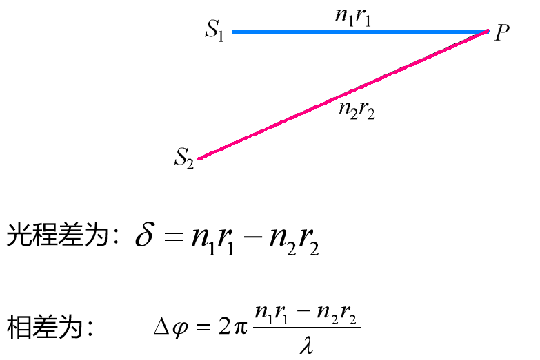

$A = \sqrt{A_1^{2}+A_2^2+A_1\cdot A_2\cos\Delta\varphi} $

### 四、等厚干涉

1. 劈形膜干涉
2. 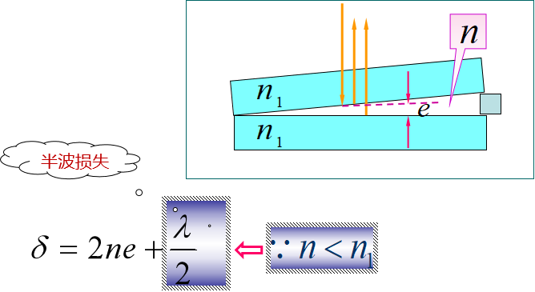

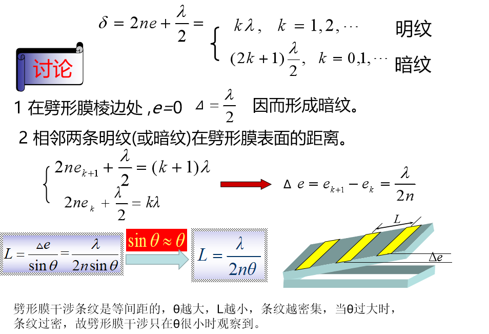

> 劈形膜干涉条纹是等间距的，θ越大，L越小，条纹越密集，当θ过大时，条纹过密，故劈形膜干涉只在θ很小时观察到。

#### 应   用

- **测量微小角度**

- **干涉膨胀仪**

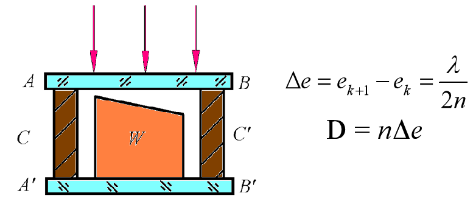

> 温度改变，空气层的厚度改变，将有条纹的移动.因此，测出条纹移动的数目，就可测出劈形膜下表面的升高量(即样品尺寸的改变量)，由此可算出样品的热膨胀系数. 

- 检验光学元件表面的平整度

- 测细丝的直径

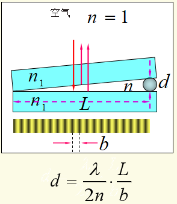

###  牛顿环

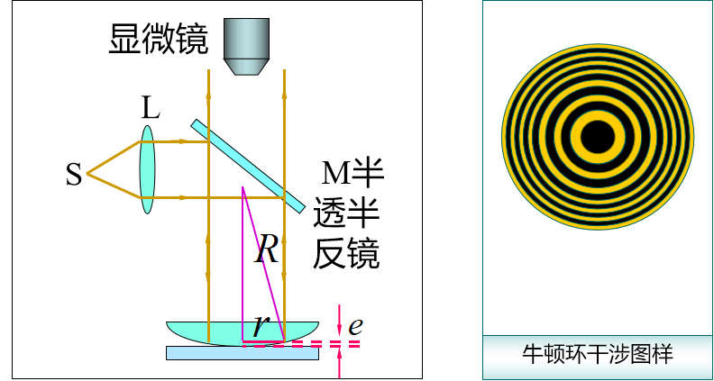

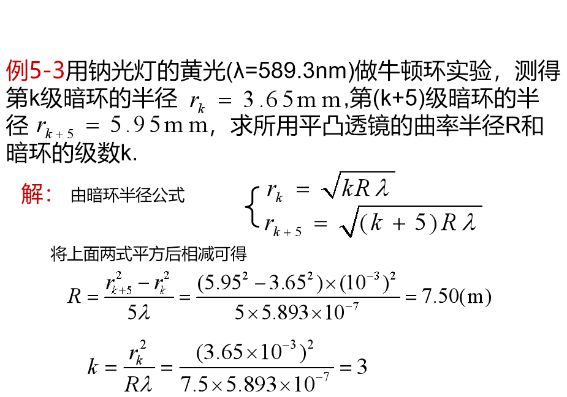

$r_k=\sqrt{kR\lambda}$

### 五、增透膜和增反膜

#### 1.增透膜

> 入射单色光在膜的两个表面上反射的两束光因干涉而互相抵消，这样就可以减少光的反射，这种使透射光增强的薄膜就叫**增透膜**. 

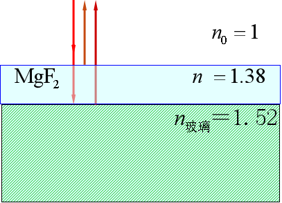

### 2.增反膜

> 与增透膜相反，若镀膜层的厚度，恰好使单色光在膜的上、下表面上的反射光因干涉而加强，则这种使反射光加强的膜叫**增反膜**. 

### 六、迈克尔孙干涉仪

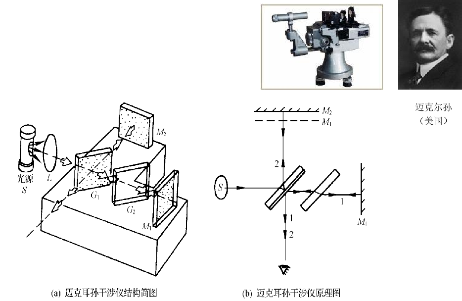

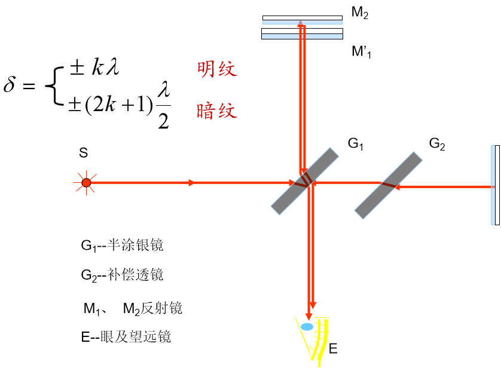

> 若入射单色光波长为λ，则每当$M_2$向前或向后移动λ/2的距离时，就可看到干涉条纹平移过一条.所以计算视场中移过的条纹数目m，就可以算出$M_2$移动的距离x 

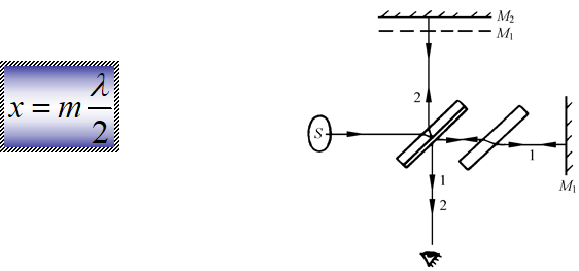

- 用已知波长的光波可以测定长度(即M2 移动的距离)
- 由已知长度来测定光波的波长.

## 2.光的衍射

### 一、光的衍射现象  惠更斯-菲涅尔原理

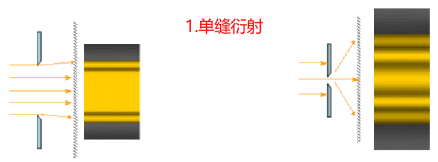

> 当光通过较宽的狭缝时，在屏幕上映出单缝像，呈现为一宽带。这时可认为光是沿直线传播的。    
>
> 如果缩小单缝的宽度，当缝宽小到可以与波长相比拟($10^{-4}m$数量级以下)时，在屏幕上出现的亮带虽然亮度降低，但宽度反而增大，甚至有一小部分光偏折到亮带的两侧，呈现明暗相间的条纹。这种现象称为**光的衍射**。

#### 2. 惠更斯-菲涅尔原理

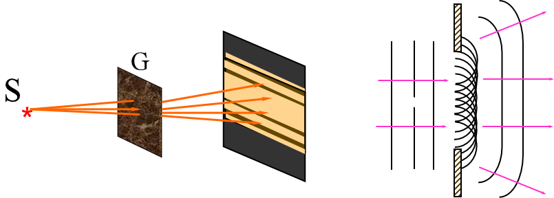

​    从同一波面上各点发出的子波，在传播到空间某一点时，各个子波之间也可以相互叠加而产生干涉现象.这就是**惠更斯-菲涅耳原理**.

### 二、夫琅禾费单缝衍射

入射在衍射缝上的是平行光，观察的衍射光也是平行光. 

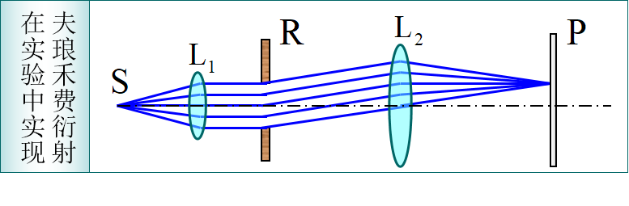

两个透镜$L_1$和$L_2$的应用，就相当于把光源推到无穷远处.

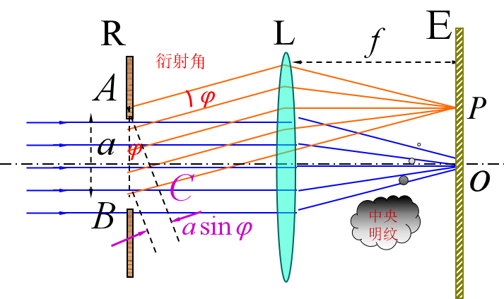

> （衍射角$\varphi$：向上为正，向下为负 ）
>
> O点出现平行于单缝的明条纹，称为**中央明纹**。

#### 2.最大光程差

从单缝的A和B两端点发出的子波到达P点的光程差 

> $BC=a\sin\varphi$

#### 3. 菲涅尔半波带法

以单色光的波长的一半（$\frac{\lambda}{2}$） 来划分最大光程差BC，并假设BC恰好等于单色光半波长的整数倍，即 

> $BC=a\sin\varphi,k=1,2,3,\cdots$

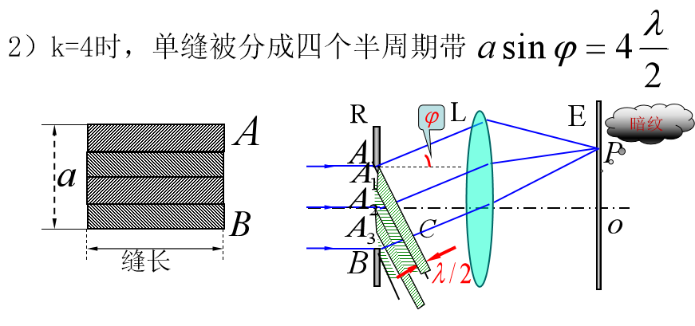

> ​    $AA_1$与$A_1A_2$、 $A_2A_3$与$A_3B$对应点子波光程差恒为$\frac{\lambda}{2}$。即到达P点的相位差为  ，因而对应点子波的光强完全抵消.$AA_1$与$A_1A_2$、$A_2A_3$与$A_3B$两两半周期带相互抵消，于是P点处出现暗纹。

##### 结论

>   单缝正好分为奇数个半周期带，则必然留下一半周期带的光未被抵消，于是P点处出现亮纹。

#### 4. 光强分布

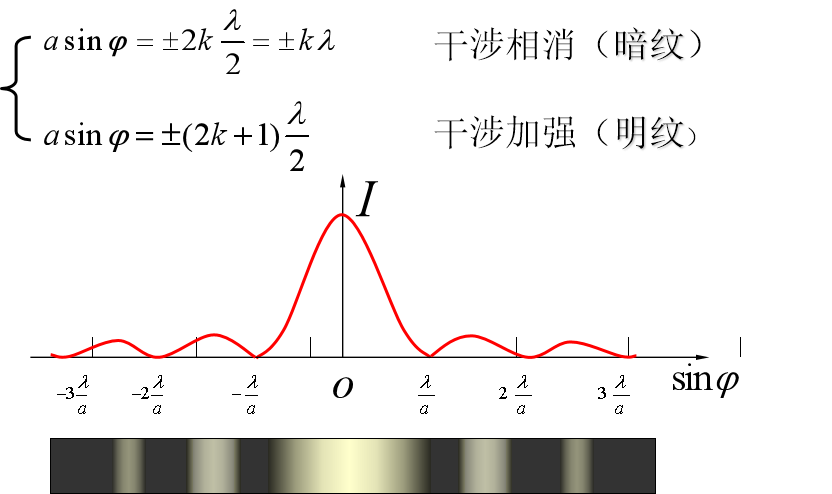

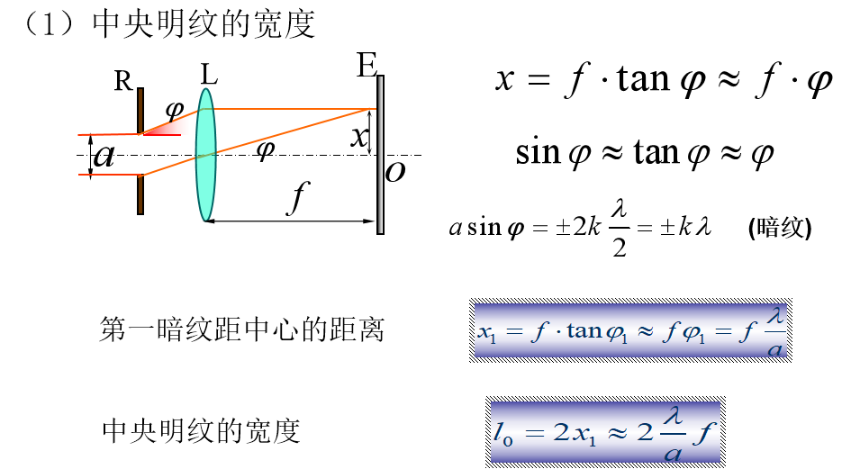

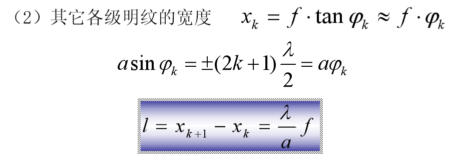

##### 结论

>   除中央明纹外，其它明纹的宽度相等，中央明纹的宽度为其它明纹宽度的两倍。 

##### 例题

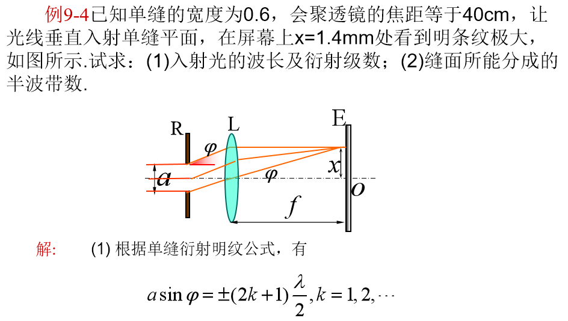

### 三、光学仪器的分辨本领

#### 1. 圆孔衍射

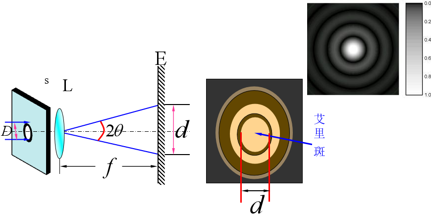

理论计算可得，艾里斑对透镜光心的张角度的一半为:

$\theta=1.22\frac{\lambda}{D} \space\space\space \tan\theta  \approx \sin\theta = \frac{d}{2f}$

#### 2. 光学仪器的分辨本领

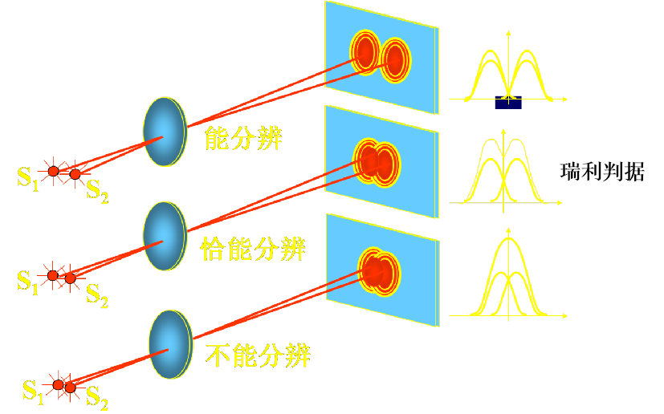

**提高光学仪器的分辨本领的方法**：

- 增大透镜的直径
- 减小入射光的波长

##### 例题

### 三.光的衍射

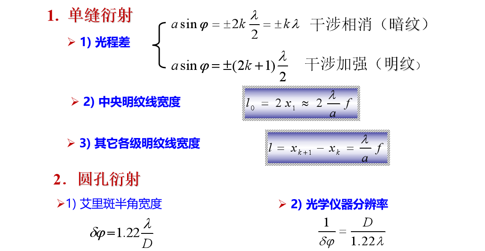