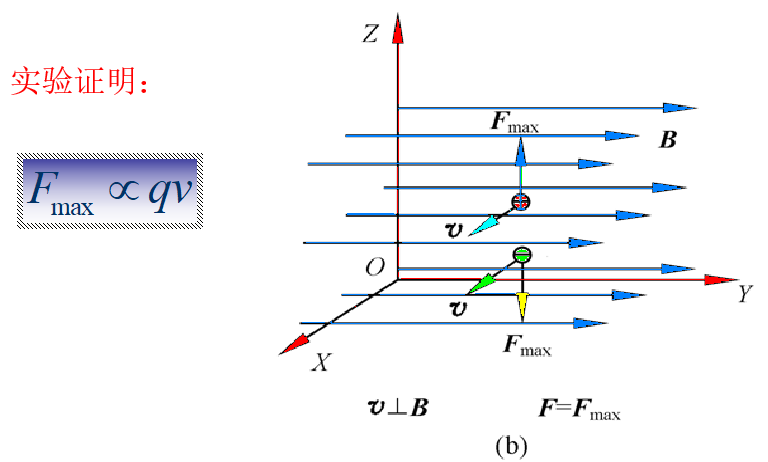

# 第一节  基本磁现象

## 磁性的起源

人类最早发现磁现象是从天然磁石能够吸引铁制物体的现象开始的.我国是发现天然磁铁最早的国家. 

公元前250年前韩非子“有度”篇中有“司南”的记载 。

## 永久磁铁及其特性

### 8.1    基本磁现象

 1.天然磁铁----磁铁矿（Fe3O4）

2.人造磁铁

-  有些铁制的物体在经磁石吸引后，本身也具有了吸    铁的本领，这就是人造磁铁.
- 把铁磁性物质，如铁、钴、镍或它们的合金制成各    种形状.如条形、马蹄形等，然后通过电流的强磁场     进行磁化，制成永久磁铁. 
- 
- 

### 特性

-  能吸引铁、钴、镍等物质--这种性质叫磁性
- 具有两极且同性相斥，异性相吸
-   地球是一个大磁铁，它的N极位于地理南极附近，     S极位于地理北极附近

## 电流的磁效应 

### 1.奥斯特实验 

 1820年，丹麦科学家奥斯特发表了自己多年的研究成果，即著名的奥斯特实验.  

在通电导线的附近小磁针会发生偏转

### 2.磁铁对电流的作用

把一段直导线水平悬挂在马蹄形磁铁的两极中间，当导线通过电流时，导线就会发生水平方向移动.

磁铁也可给电流施加作用力

### 3.电流与电流的相互作用

当两导线中分别通以相同方向的电流时，两导线相互吸引.当通以相反方向的电流时，两导线相互排斥. 

### 4.载流螺线管的磁场

一个载流的螺线管的行为很像一块条形磁铁.

用右手握住螺线管，弯屈的四指沿电流回绕方向，姆指便指向螺线管的N极

# 第二节  磁场 磁感应强度

## 磁场

  一切磁现象，都是由**运动电荷**或**电流**产生的，在运动电荷的周围会产生磁场。磁场的主要表现是：对磁场中的运动电荷或载流导体有**磁力的作用**，这种作用是通过“场”来传递的.

- 磁场对磁铁、对电流、对运动电荷均有磁作用力；
- 磁场是物质的一种形态，它的物质性表现在磁场具有一定的能量.
- 磁场是一个矢量场

## 磁感应强度矢量

### 1.磁场对运动电荷的作用

(a) 当运动电荷的速度方向与磁场方向平行时，运动电荷不受磁力作用。

(b)当运动电荷以某一速率沿垂直于磁感应强度的方向进入磁场时，它所受到的磁力最大.

### 2.磁感应强度的定义

​        1.磁感应强度$\vec{B}$的方向：正电荷通过磁场中某点受力为零时，其运动方向为该点磁感应强度$\vec{B}$的方向，具体方向与该点小磁针N极的指向相同。 

​         2. **磁感应强度大小**:当运动电荷沿垂直于磁感应强度方向进入磁场时，所受磁力最大，且磁力与运动电荷带电量及运动速度大小成正比,比值即为**磁感应强度**。

# 第三节  磁感应线 磁场中的高斯定理

## 磁感应线

在磁场中画一组有方向的曲线，来形象的描述磁场在空间的分布，这一组曲线称为磁场线。

**规定**：（1）曲线上任一点的切线方向与该点的磁感强度 B 的方向一致；

​          （2）曲线的疏密程度表示该点的B 的大小。

**性质**：（1）任意两条磁感线不能相交；

​           （2）磁感线是闭合曲线；

​           （3）方向与电流成右手螺旋关系。

**几种不同形状电流磁场的磁感应线**

## 磁通量

定义：穿过磁场中给定面的磁感线的总条数，称为通过该面的磁通量，用$\Phi_m$表示。

1.均匀磁场 ,$\vec{B}$垂直平面

2. 均匀磁场 ，$\vec{B}$  与平面夹角$\theta$

   

$$
\phi_m = BS\sin\theta \space\space = \vec{B}\cdot\vec{S}
$$

3. 非均匀磁场 ，  任意曲面

## 高斯定理

- 当磁感应线从闭合曲面内穿出时,$=>$磁通量为正 
- 当磁感应线从闭合曲面内穿入时,$=>$磁通量为负

 由于磁感应线是**闭合曲线**，因而**穿入的磁感应线必定要穿出**，因此通过任意闭合曲面的总磁通量必定为零.即 

磁感线是闭合曲线，磁场是无源场

# 第四节  毕奥-萨法尔定律

## 一、毕奥—萨伐尔定律

​    载流导线中的电流为$l$，在电流上取长为$dl$的定向线元，规定$dl$的方向与电流的方向相同,$Id\vec{l}$为**电流元**。

真空中，电流元在给定点所产生的磁感应强度的大小与Idl成正比，与到电流元的距离平方成反比，与电流元和矢径夹角的正弦成正比。

### **毕奥—萨伐尔定律的矢量式**

其中$\mu_0=4\pi\times10^{-7}N\cdot A^{-2}$，称为真空中的磁导率。

## 毕－萨定律的应用

### 1. 载流直导线在空间任意一点的磁场

求距离长度为$l$的载流直导线$a$处一点$p$的磁感应强度 $\vec{B}$

$$
dB=\frac{\mu_0}{4\pi}\cdot\frac{Idl\sin\theta}{r^{2}}
$$
