# 第一卷

1. 信息安全的五个基本属性为:可用性(availability)、可靠性(controllability)、完整性(integrity)、
   保密性(confidentiality)、不可抵赖性(non-repudiation)。
2. 哈希函数指**将哈希表中元素的关键键值映射为元素存储位置的函数**。
3. **哈希函数**将输入资料输出成**较短**的固定长度的输出，这个过程是**单向**的，逆向操作难以完成，故A、B选项错误;MD5以**512位分组**来处理输入的信息，且每一分组又被划分为16个**32位子分组**，经过了一系列的处理后，算法的输出由四个**32位分组**组成，将这四个**32位分组**级联后将生成一个**128位散列值**(信息摘要):SHA-1和MD5最大区别在于其摘要比MD5摘要长32bit，故耗时要更长，故D选项错误。故选择C选项。
4. **对称加密系统**通常非常快速，却易受攻击，因为用于加密的密钥必须与需要对消息进行解密的所有人一起共享，同一个密钥既用于加密也用于解密所涉及的文本，A、B正确;**数字签名**是**非对称密钥加密技术**与**数字摘要技术**的综合应用，在操作上会有定的难度，故D正确，**对称加密**最大的**缺点**在于**其密钥管理困难**。故选择C选项。
5. 哈希函数的应用有:**消息认证、数字签名、口令的安全性、数据完整性**。对于口令的完全性，由于**哈希函数具有单向性的特征**，因此在口令保护中应用非常广泛。通常，仅将口令的哈希值进行保存，进行口令校验的时候比对哈希值即可，即使攻击者获得了保存的哈希值，也无法计算出口令。典型的哈希函数有两类:消息摘要算法(Message Digest Algorithm，MD5)和安全散列算法(Secure Hash Algorithm, SHA)本题只允许使用MD5、AES和Diffie-Hellman算法，所以本题答案为:MD5
6. [密码学基础：AES加密算法 - 知乎 (zhihu.com)](https://zhuanlan.zhihu.com/p/78913397)
7. **在密码标准征集中，所有AES候选提交方案都必须满足以下标准：**
   - **分组大小为128位的分组密码。**
   - **必须支持三种密码标准：128位、192位和256位。**
   - **比提交的其他算法更安全。**
   - **在软件和硬件实现上都很高效。**

## AAA协议Diameter和RADIUS比较

总结今天就把两种主要的AAA协议Diameter和RADIUS进行比较总结,如下:

(1)**RADIUS固有的C/S模式(固有的客户端/服务器模式)**限制了它的进一步发展。Diameter采用了**peer-to-peer(端到端)模式**，peer的任何一端都可以发送消息以发起计费等功能或中断连接。

(2)**可靠的传输机制**。**RADIUS**运行在**UDP协议**上，并且**没有定义重传机制**，而**Diameter**运行在可靠的传输协议**TCP、SCTP**之上。Diameter 还支持窗口机制，每个会话方可以动态调整自己的接收窗口，以免发送超出对方处理能力的请求。

(3)**失败恢复机制**。**RADIUS**协议**不支持失败恢复机制**，而**Diameter支持应用层确认**，并且定义了失败恢复算法和相关的状态机，能够立即**检测出传输错误**。

(4)**大的属性数据空间**。Diameter采用**AVP**（Attribute ValuePair）来传输用户的认证和授权信息、交换用以计费的资源使用信息、中继代理和重定向 Diameter 消息等。**网络的复杂化**使Diameter消息所要携带的**信息越来越多**，因此属性空间一定要足够大，才能满足未来大型复杂网络的需要。

(5)**支持同步的大量用户的接入请求**。随着网络规模的不断扩大，AAA服务器需要同时处理的用户请求的数量不断增加，这就要求网络接入服务器能够保存大量等待认证结果的用户的接入信息，而RADIUS 的255个同步请求显然是不够的，**Diameter 可以同时支持 232 个用户的接入请求**。

(6)**服务器初始化消息**。由于在**RADIUS中服务器不能主动发起消息**，只有客户能发出重认证请求，所以服务器**不能根据需要重新认证**。而Diameter指定了两种消息类型，重认证请求和重认证应答消息，使得服务器可以随时根据需要主动发起重认证。

(7)**Diameter还支持认证和授权分离**，重授权可以随时根据需求进行。而**RADIUS**中认证与授权必须是成对出现的。

(8)**RADIUS**仅仅在应用层上定义了一定的安全机制，但**没有涉及到数据的机密性**。**Diameter**要求必须**支持IPsec以保证数据的机密性和完整性**。

(9)**RADIUS没有明确的代理概念**，**RADIUS服务器**同时具有**proxy服务器**和**前端服务器**的功能。**Diameter加入代理**来承担**RADIUS服务器的proxy功能**

[网络安全基础之访问控制模型详解——DAC, MAC, RBAC_mac强制访问控制模型-CSDN博客](https://blog.csdn.net/Demonslzh/article/details/135376021)

【解析】**BLP**模型基于**强制访问控制系统**，以**敏感度来划分资源**的安全级别。**Biba访问控制模型**对数据提供了**分级别的完整性保证**，类似于**BLP保密模型**，也使用强制访问控制系统。ChineseWall安全策略的基础是**客户访问的信息不会与目前他们可支配的信息产生冲突**。**用户必须选择一个他可以访问的区域**，**必须自动拒绝来自其它与用户的所选区域的利益冲突区域的访问**，同时包括了**强制访问控制**和**自主访问控制的属性**。RBAC模型是20世纪90年代研究出来的一种新模型。这种模型的基本概念是把**许可权与角色联系在一起**，用户通过**充当合适角色的成员**而**获得该角色的许可权**。故选择C选项。

[内网安全——Kerberos协议详细全解_kerberos协议模型中能安装在网络上的实体是-CSDN博客](https://blog.csdn.net/m0_67189356/article/details/126965241)

[什么是单点登录（SSO） - 知乎 (zhihu.com)](https://zhuanlan.zhihu.com/p/66037342)

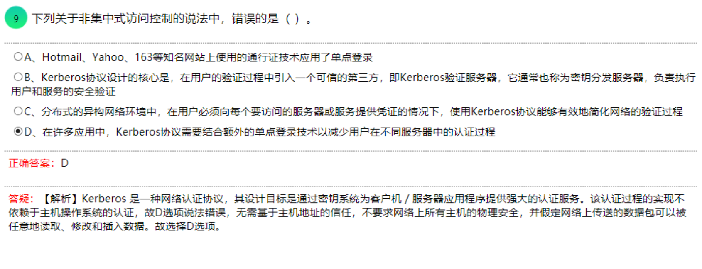

- IKE属于一种混合型协议，由Internet安全关联和密钥管理协议(ISAKMP)和两种密钥交换协议OAKLEY与SKEME组成。Kerberos不属于IKE协议。

- 
  PKI（公钥基础设施）系统通常包括以下组件：

  A、CA（证书颁发机构） - 负责颁发和管理数字证书的可信实体。
  B、RA（注册机构） - 辅助CA进行身份验证和注册证书请求的实体。
  D、LDAP（轻量目录访问协议） - 用于在网络中存储和检索信息的协议。

  因此，典型的PKI系统不包括 C、CDS。CDS（证书分发系统）在某些PKI系统中可能是一个组件，但它并不是PKI系统的核心组成部分，因此在给定的选项中可能不会包括。

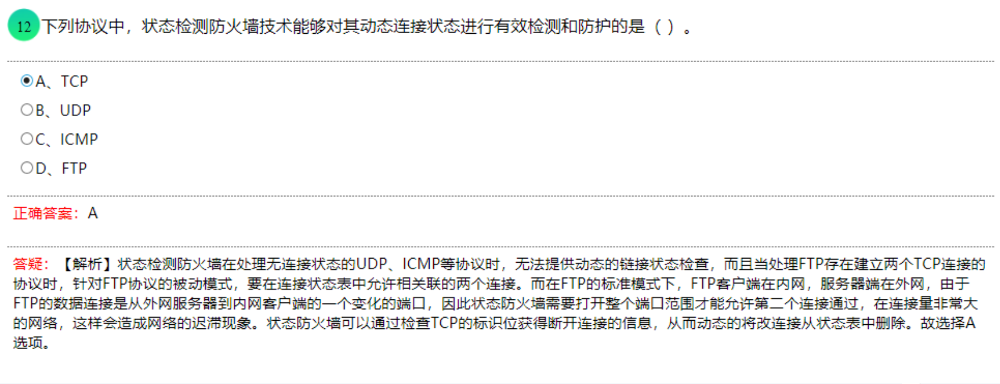

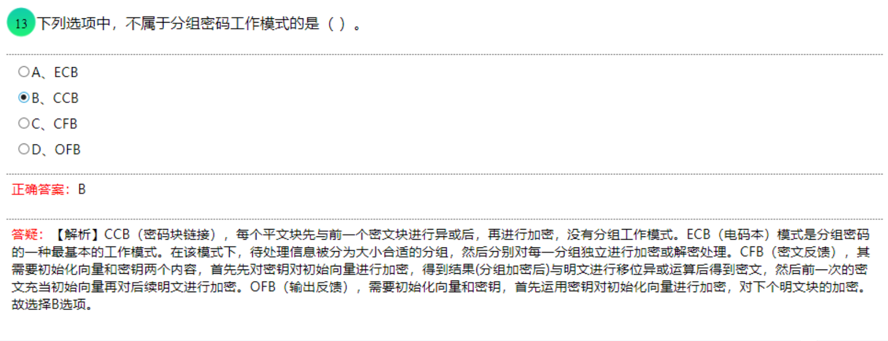

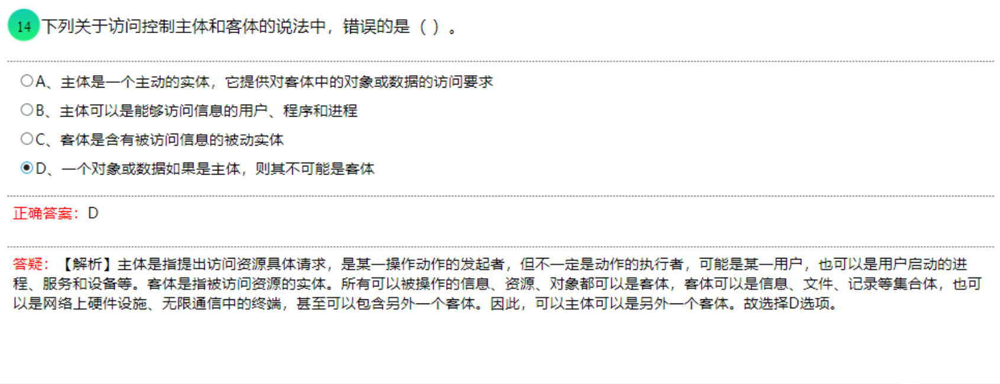

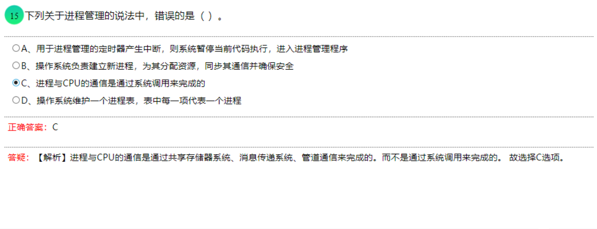

- chmod:文件/目录权限设置命令;chown:改变文件的拥有者;chgrp:变更文件与目录的所属群组，设置方式采用群组名称或群组识别码皆可;who:显示系统登陆者。故选择C选项。
- 在linux或者unix操作系统中在系统的引导的时候会开启很多服务，这些服务就叫做**守护进程**。为了增加灵活性，root可以选择系统开启的模式，这些模式叫做运行级别，每一种运行级别以一定的方式配置系统。**守护进程**是脱离于终端并目在后台运行的进程。**守护进程**脱离于终端是**为了避免进程在执行过程中的信息在任何终端上显示并且进程也不会被任何终端所产生的终端信息所打断**。守护进程常常在系统引导装入时启动，在系统关闭时终止。**Linux系统有很多守护进程，大多数服务都是通过守护进程实现的**，同时，守护进程还能完成许多系统任务，例如，作业规划进程crond、打印进程lqd等，故选择C选项。

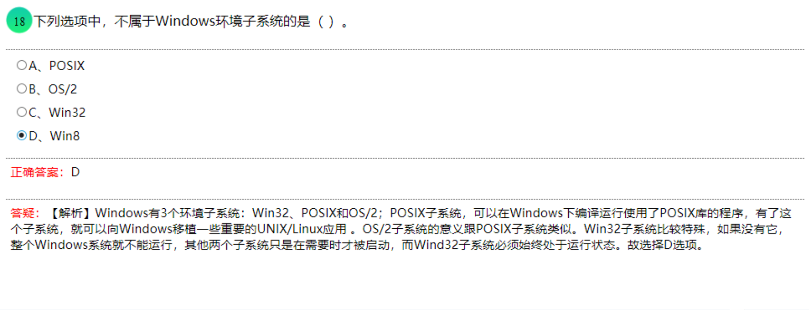

- 由于事务是由几个任务组成的，**因此如果一个事务作为一个整体是成功的，则事务中的每个任务都必须成功。如果事务中有一部分败，则整个事务失败**。一个事务的任何更新要在系统上完全完成，如果由于某种原因出错，事务不能完成它的全部任务，系统将返回到事务开始前状态。COMMIT语句用于告诉DBMS，事务处理中的语句被成功执行完成了。被成功执行完成后，数据库内容将是完整的。而ROLLBACK语句则是于告诉DBMS，事务处理中的语句不能被成功执行。不能回退SELECT语句，因此该语句在事务中必然成功执行。故选择C选项。
- P2DR模型包括四个主要部分:**Policy(策略)**、**Protection(防护)**、**Detection(检测)**和 **Response(响应)**，在整体的安全策略的控制和指导下，在综合运用防护工具(如防火墙、操作系统身份认证、加密等)的同时，利用检测工具(如漏洞评估、入侵检测等)了解和评估系统的安全状态,通过适当的反应将系统调整到“最安全”和“风,险最低”的状态。防护、检测和响应组成了一个完整的、动态的安全循环，在安全策略的指导下保证信息系统的安全。故选择A选项。
- P2DR模型是美国ISS公司提出的动态网络安全体系的代表模型。在该模型的四个组成部分中，核心是(策略)。

[TCP-IP详解：ESP(IPSec Encapsulating Security Payload)-CSDN博客](https://blog.csdn.net/wdscq1234/article/details/52705458)

（IPSec封装安全负载）

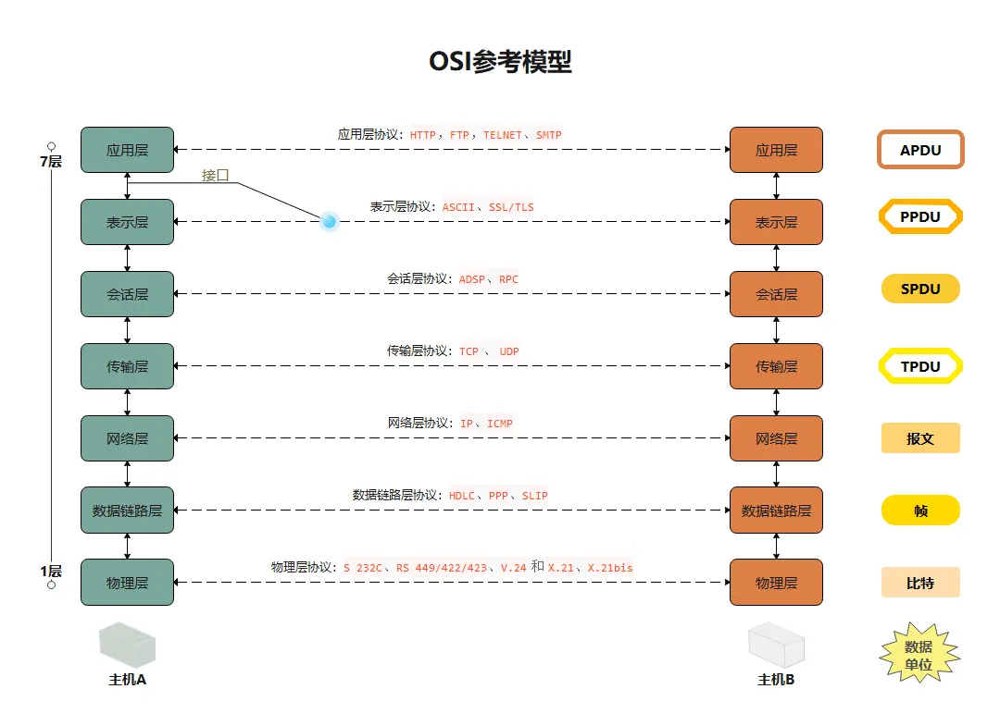

[一文看懂网络七层协议/OSI七层模型 (zhihu.com)](https://www.zhihu.com/tardis/zm/art/296670054?source_id=1005)

- ESP协议主要设计在 IPv4 和 Pv6 中提供安全服务的混合应用。IESP 通过加密需要保护的数据以及在 ESP 的数据部分放置这些加密的数据来提供机密性和完整性。且ESP加密采用的是**对称密钥加密算法**，能够**提供无连接的数据完整性验证、数据来源验证和抗重放攻击服务**。根据用户安全要求，这个机制既可以用于**加密一个传输层**的段(如:TCP、UDP、ICMPIGMP)，也可以用于**加密一整个的IP数据报**。封装受保护数据是非常必要的，这样就可以为整个原始数据报提供机密性，但是，**ESP协议无法封装链路层协议**。

- Kerperos 是一种网络认证协议，而不是加密协议或完整性检验协议。其设计目标是通过密铜系统为客户机,/服务器应用程序提供强大的认证服务。

- **HTTPS**是以安全为目标的HTTP通道，简单讲是HTTP的安全版。即HTTP下加入SSL层，HTTPS的安全基础是SSL因此加密的详细内容就需要SSL。它是一个URl scheme，句法类同htp体系，用于安全的HTTP数据传输。httos:URL表明它使用了HTTP，但HTTPS存在不同于HTTP的默认端口及一个加密/身份验证层(在HTTP与TCP之间)。这个系统的最初研发由网景公司进行，提供了身份验证与加密通讯方法，因此用户认证的请求通过**加密信道**进行传输，现在它被广泛用于万维网上安全敏感的通讯。

- **AH(Authentication Header)**
  这个协议主要是用来提供数据**完整性校验**和**源校验**，即只提供校验功能，并没有提供加密功能，我们知道对于这种虚拟的私有网络，实际上是公网上虚拟出来的隧道，核心在于要对对应协议的数据包进行IP层的封装，让其仍然变成IP包，然后在公网上传输，所以先看下AH协议不同模式下封装的数据

  原文链接：https://blog.csdn.net/wdscq1234/article/details/52677419

- IPV4中TCP/IP协议栈，**没有口令保护**,远程用户的登录传送的帐号和密码都是**明文**,这是Tenet致命的弱点;认证过程简单,只是验证连接者的帐户和密码;传送的数据没有加密等。IPv4中**TCP/IP协议栈**提供了**端到端可靠传输机制**。

- **SMTP**:简单邮件传输协议,它是一组用于由源地址到目的地址传送邮件的规则，由它来控制信件的中转方式**SET**:安全电子交易协议:**POP3**:邮局协议的第3个版本，它是规定个人计算机如何连接到互联网上的邮件服务器进行收发邮件的协议。**S/MIME**为**多用途网际邮件扩充协议**，在**安全方面**的功能又进行了**扩展**，它可以把**MIME实体**(比如数字签名和加密信息等)封装成安全对象。故选择B选

- **基于网络的入侵检测（NIDS）:**基于**网络**的入侵检测（NIDS）以所检测**网段的所有流量**作为**其数据源**，在以太网环境下，它通过将网卡设置为混杂模式来抓取所监测网段内的混合数据包。一般来说入侵检测系统担负着保护整个网段的任务。在交换环境下，为了抓取所需的数据，NIDS的放置需要精心的设计。**NIDS通过对三类特征进行匹配**，从而发现可能的入侵检测行为，这三类特征分别是：**串特征、端口特征和数据包头特征**。串特征是指在数据正文中出现的可能意味着某种攻击的字符串。例如一个数据包的正文中包含字符串“cat”++>/.rhosts”， 那么如果这条命令执行成功, 将导致执行该命令的主机不需身份认证就被使用，这是非常危险的事情。端口特征是指某个连接连向的目的端口，通过查看这个值，也可以发现一些可能的入侵，例如一些木马程序就是通过一些特定的端口拉接收外部的控制信息的。数据包头特征是指数据头中的码位的一些非常危险的非法组合，其中最为著名的是winnuke，它通过目标机NetBIOS使用的139端口发送设置了紧急指针位的（Urgent Pointer）、表明有带外数据（out of band）的TCP数据包，从而使一些安装Window操作系统的机器出现蓝屏死机。

- NIDS是Network Intrusion Detection System的缩写，即网络入侵检测系统，主要用于检测Hacker或Cracker通过网络进行的入侵行为。NIDS提供的功能主要有数据的收集，如数据包探;事件的响应，如利用特征匹配或异常识别技术检测攻击并产生响应;事件的分析，事件数据存储。所以其探测器要连接在交换机上。故选择D选项。

- 私有IP地址范围:

- A: 10.0.0.0-10.255.255.255 即10.0.0.0/8

- B:172.16.0.0~172.31.255.255即172.16.0.0/12

- C:192.168.0.0-192.168.255.255 即192.168.0.0/16

- **BitBlaze**平台由三个部分组成:Vine，静态分析组件，TEMU，动态分析组件，Rudder，**结合动态和静态分析进行具体和符号化分析的组件**。**Nessus**是目前全世界最多人使用的**系统漏洞扫描与分析软件**。**Metasploit**是一个免费的、可下载的框架，通过它可以很容易地获取、开发并**对计算机软件漏洞实施攻击**。**NMap**，也就是Network Mapper，是Linux下的**网络扫描和**
  **嗅探工具包**。故选择C选项。

- **OWASP的十大安全威肋排名**:**第一位:注入式风险**;第二位:跨站点脚本(简称XSS);第三位: 无效的认证及会话管理功能;第四位:对不安全对象的直接引用;第五位:伪造的跨站点请求(简称CSRF);第六位: 安全配置错误;第七位:加密存储方面的不安全因素;第八位:不限制访问者的URL;第九位:传输层面的保护力度不足;第十位: 未经验证的重新指向及转发。故选择C选项。[小白必看!OWASP top 10详解 - 知乎 (zhihu.com)](https://zhuanlan.zhihu.com/p/393635352)

- **安全开发周期**，Security Development Lifecycle (SDL)，是**微软**提出的从安全角度指导软件开发过程的管理模式。微软于2004年将SDL引入其内部软件开发流程中，目的是减少其软件中的漏洞的数量和降低其严重级别。故选择A选项。

- **代码混淆技术**在保持原有代码功能的基础上，通过代码变换等混淆手段实现降低代码的人工可读性、隐藏代码原始逻辑的技术。代码混淆技术可通过多种技术手段实现，包括**词法转换、控制流转换、数据转换**。故选择A选项。

- **漏洞的定义**包含以下**三个要素**:首先，**漏洞**是计算机系统本身存在的**缺陷**;其次，漏洞的存在和利用都有一定的环境要求;最后，**漏洞**存在的**本身是没有危害的**，只有被攻击者恶意利用，才能给计算机系统带来威胁和损失。故选择C选项

- 堆生长方向是向上的，也就是向着内存增加的方向;栈相反   [什么是栈（Stack）？什么是堆（Heap）？栈和堆的区别是什么？-CSDN博客](https://blog.csdn.net/Menqq/article/details/108740872)

- **缓冲区溢出**是指当计算机向**缓冲区内填充数据位数时超过了缓冲区本身的容量**，**使得溢出的数据覆盖在合法数据上**，理想的情况是程序检查数据长度并不允许输入超过缓冲区长度的字符，但是绝大多数程序都会假设数据长度总是与所分配的储存空间相匹配，这就为缓冲区溢出埋下隐患，**操作系统所使用的缓冲区**又**被称为"堆栈"**。在各个操作讲程之间，指令会被临时储存在**"堆栈"**当中，"堆栈"也会出现缓冲区溢出，**单字节溢出是指程序中的缓冲区仅能溢出一个字节**。故选择B选项。

- **涉密信息系统**按照所处理信息的最高密级，由低到高分为**秘密、机密、绝密**三个等级。

- 基本安全要求中基本技术要求从五个方面提出:**物理安全、网络安全、主机安全、应用安全、数据安全**及**备份恢复**;    **路由安全不是基本安全要求中基本技术**。故选择B选项。

- 应急计划三元素是**事件响应 、灾难恢复、业务持续性计划**。基本风险评估预防风险，而应急计划则是当风险发生时采取的措施。故选择A选项。

- **审核**是指**为获得审核证据**并**对其进行客观的评价**，以确定满足审核准则的程度所进行的系统的独立的并形成文件的过程。**加强安全教育**与**审核对象**没有关系。故选择B选项。

- 《电子签名法》规定，**可靠的电子签名**与**手写签名**或者**盖章具有同等的法律效力**。

  根据《电子签名法》的规定，**同时符合下列四个条件的电子签名视为可靠的电子签名**:

  (1)电子签名**制作数据**用于电子签名时，**属于电子签名人专有**;

  (2)签署时电子签名制作数据**仅由电子签名人控制**;

  (3)签署后对**电子签名**的**任何改动能够被发现**;

   (4)签署后对**数据电文内容和形式**的**任何改动能够被发现**。故选择C选项。

- 根据商用密码产品销售管理规定，申请《商用密码产品销售许可证》的单位应当具备下列条件:
  (1)有独立的法人资格。

  (2)有熟悉商用密码产品知识和承担售后服务的人员以及相应的资金保障;

  (3)有完善的销售服务和安全保密管理制度;
  (4)法律、行政法规规定的其它条件。

- 《中华人民共和国电子签名法》第三十一条电子认证服务提供者不遵守认证业务规则、未妥善保存与认证相关的信息，或者有其他违法行为的，由国务院信息产业主管部门责令限期改正;**逾期未改正的，吊销电子认证许可证书**，其直接负责的主管人员和其他直接责任人员**十年内**不得从事电子认证服务。吊销电子认证许可证书的，应当予以公告并通知工商行政管理部门。故选择B选项，
- 电子签名是指数据电文中以电子形式所含、所附用于识别签名人身份并表明签名人认可其中内容的数据，是一种电子代码，利用它，收件人便能在网上轻松验证发件人的身份和签名。它还能验证出文件的原文在传输过程中有无变动。**公用事业服务信息文件无需进行验证**，故选择C选项。

## 填空题

- 计算机系统安全评估的第一个正式标准是**可信计算机评估标准**，它具有划时代的意义，为计算机安全评估奠定了基础。
- 信息安全的发展大致经历了三个主要阶段:**通信保密阶段**、计算机安全阶段和信息安全保障阶段。
- 由于网络信息量十分巨大，仅依靠人工的方法难以应对网络海量信息的收集和处理，需要加强相关信息技术的研究，即网络**舆[yú]情分析**技术。
- 消息摘要算法MD5可以对任意长度的明文，产生(**128**)位的消息摘要。
- 验证所收到的消息确实来自真正的发送方且未被篡改的过程是**消息认证**
- 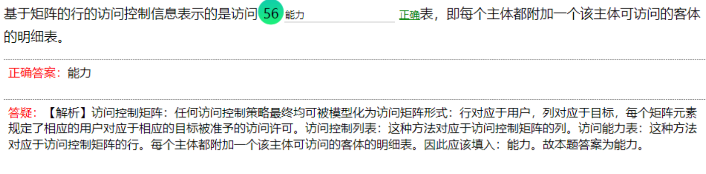
- 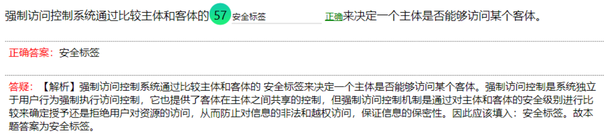

- 在标准的模型中，将CPU模式从用户模式转到内核模式的唯一方法是触发一个特殊的硬件
  **自陷**，如中断、异常等。
- 在Unix/Linux中，每一个系统与用户进行交流的界面，称为**终端**
- 在Unix\Linux系统中，**root**账号是一个超级用户账户。以超级用户可以对系统进行任何操作。
- 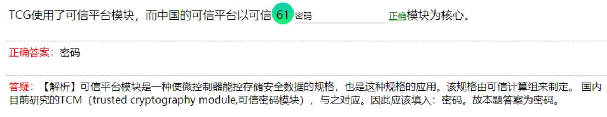
- 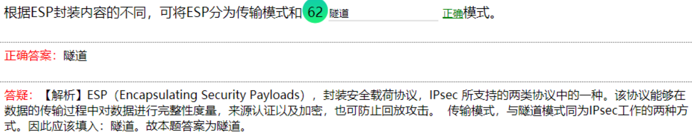
- 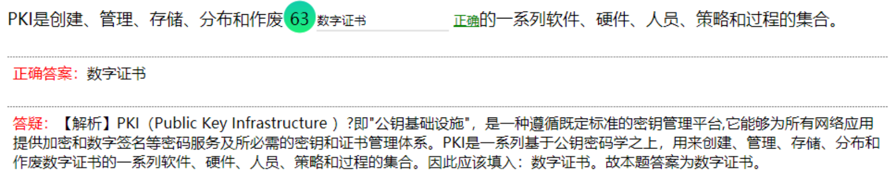
- 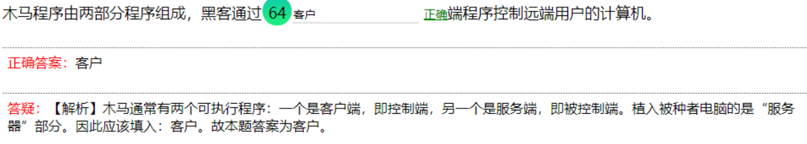
- 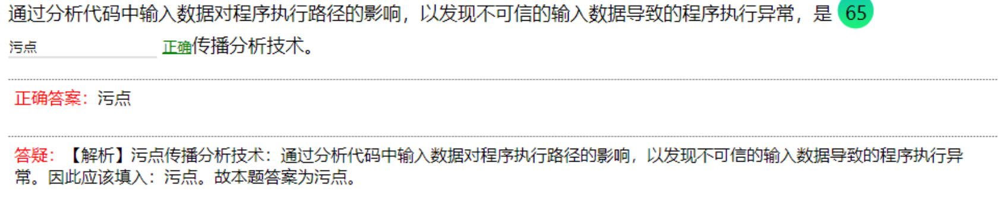
- 恶意影响计算机操作系统、应用程序和数据的完整性、可用性、可控性和保密性的计算机程序是**恶意程序**
- 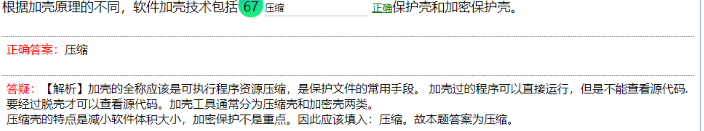
- 处于未公开状态的漏洞是**0day**漏洞。
- 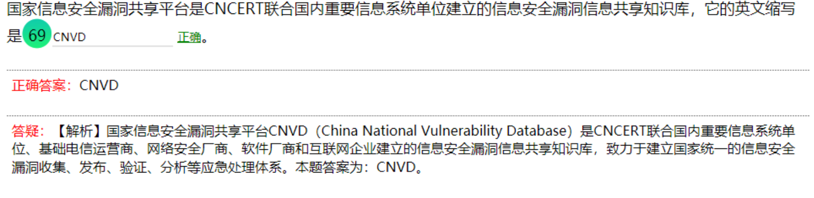
- 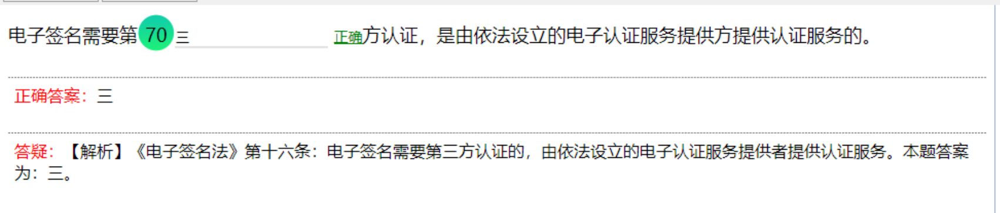

## 大题

TCP握手

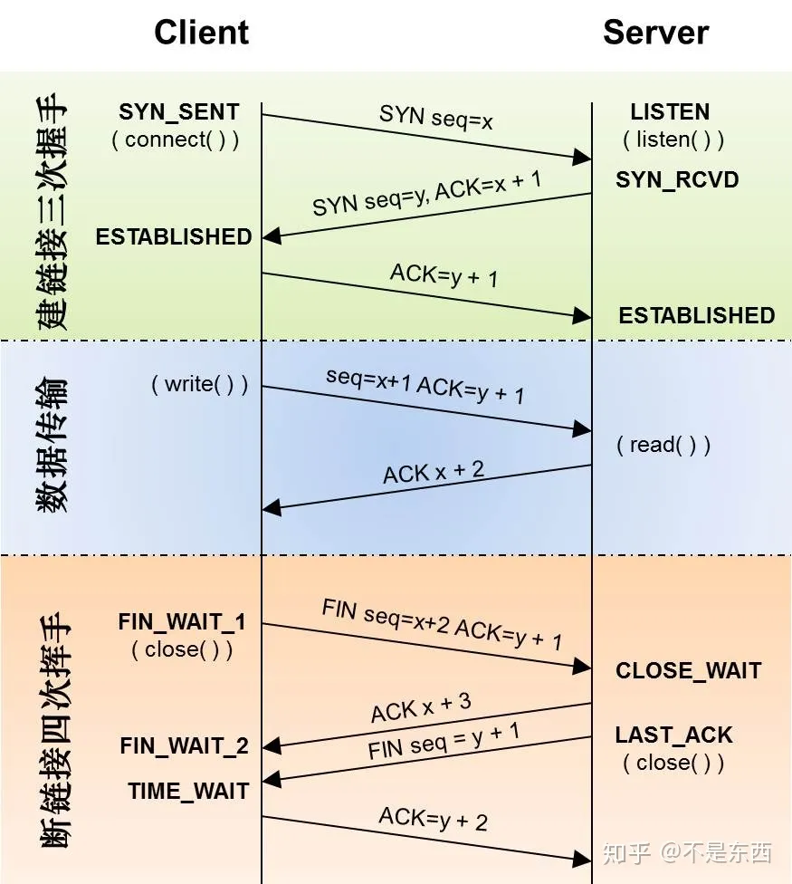

[通俗理解TCP协议通俗 (握手和挥手） - 知乎 (zhihu.com)](https://zhuanlan.zhihu.com/p/37454108)

[TCP协议RST：RST介绍、什么时候发送RST包_tcp 客户端发rst原因-CSDN博客](https://blog.csdn.net/guowenyan001/article/details/11766929)

   RST标示复位、用来异常的关闭连接。

​      1. 发送RST包关闭连接时，不必等缓冲区的包都发出去，直接就丢弃缓冲区中的包，发送RST。

​      2. 而接收端收到RST包后，也不必发送ACK包来确认。

当其中一方要关闭连接时，发送RST包

二、什么时候发送RST包

      1.  建立连接的SYN到达某端口，但是该端口上没有正在 监听的服务。
    
      2. TCP收到了一个根本不存在的连接上的分节。
    
      3. 请求超时。 使用setsockopt的SO_RCVTIMEO选项设置recv的超时时间。接收数据超时时，会发送RST包。

# 第二卷

- 
- 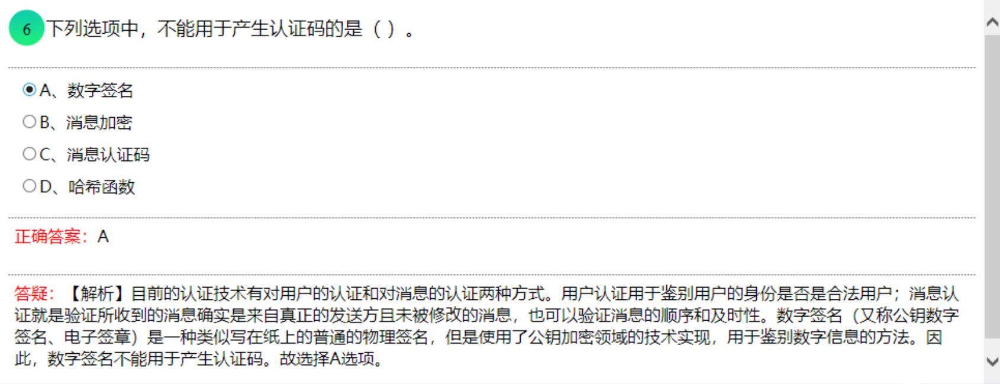
- 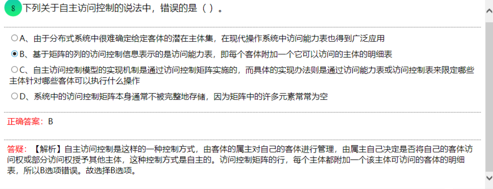
- 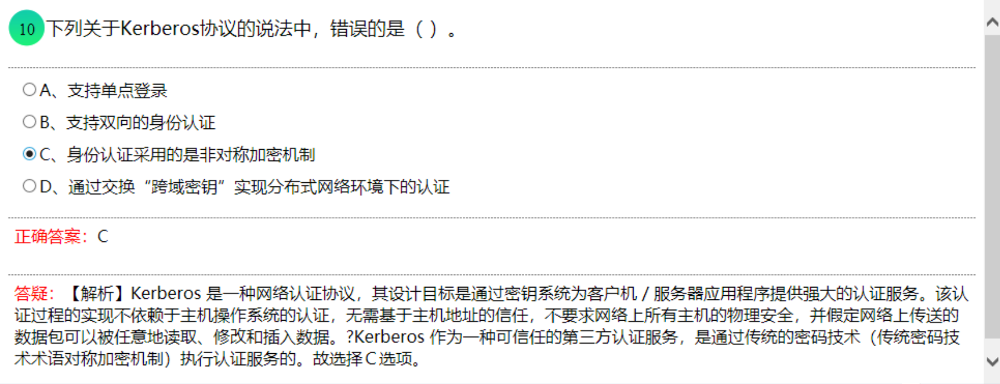
- [加密模式介绍（ECB、CBC、PCBC、CFB、OFB、CTR）-CSDN博客](https://blog.csdn.net/weixin_42272869/article/details/124278342)
- 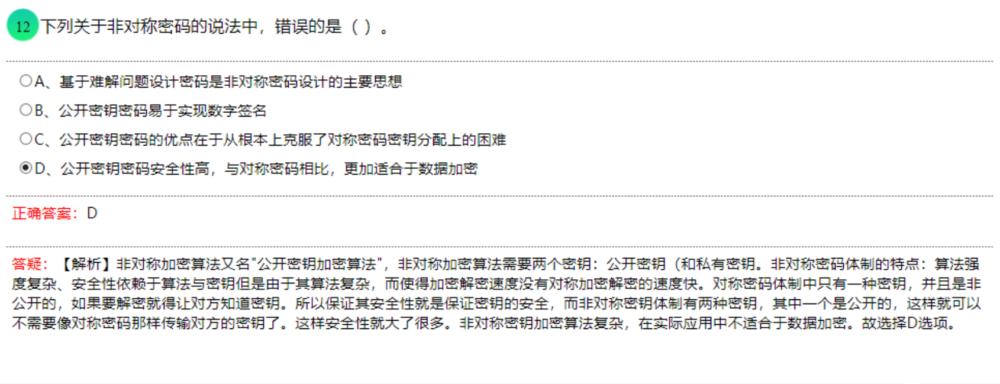

[【对称加密与非对称加密】-- 概念、图示、优缺点_对称加密和非对称加密的优缺点-CSDN博客](https://blog.csdn.net/qq_44005101/article/details/124239696)

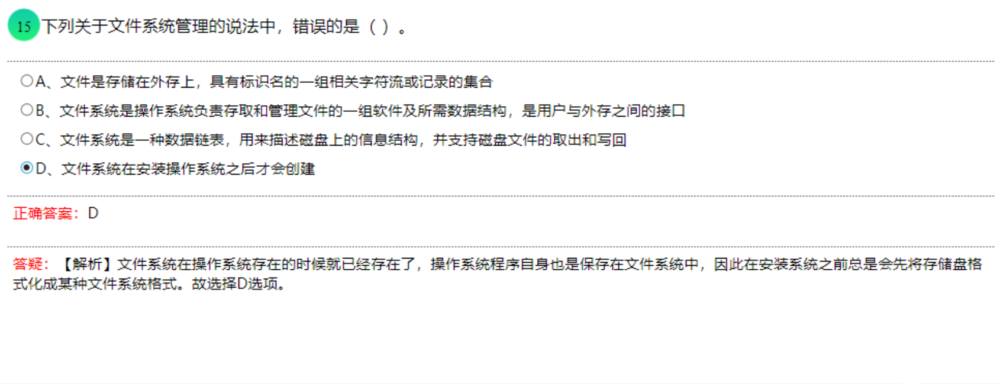

- Linux系统启动后运行的第一个进程是**初始化**的进程，即init进程;而boot是在Linux启动之前运行的进程，
  system进程和login进程是后续部分的进程。故选择A选项。
- 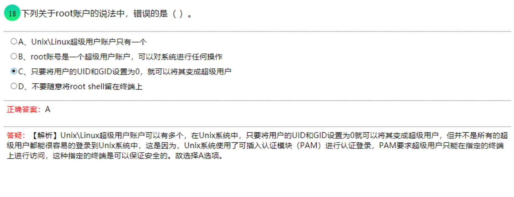
- 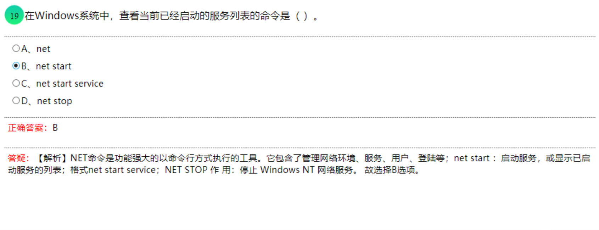
- 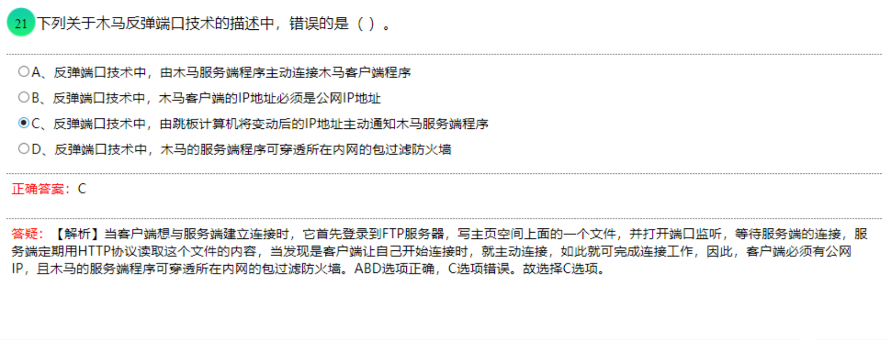

- 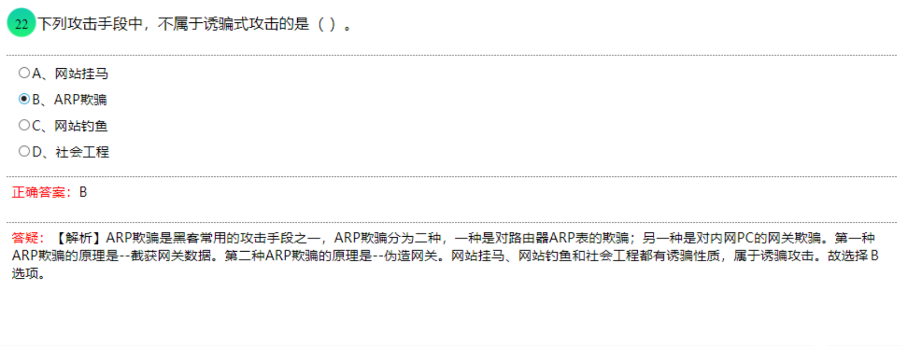
- 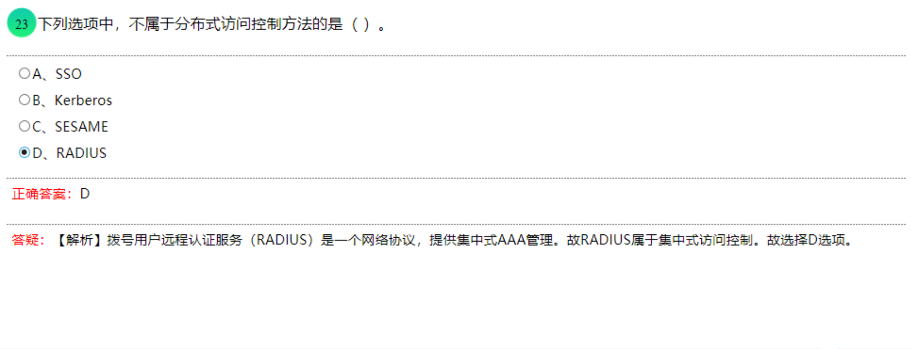
- 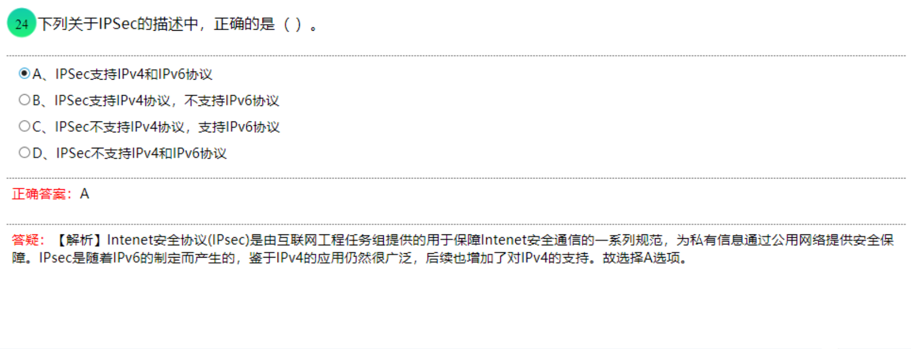
